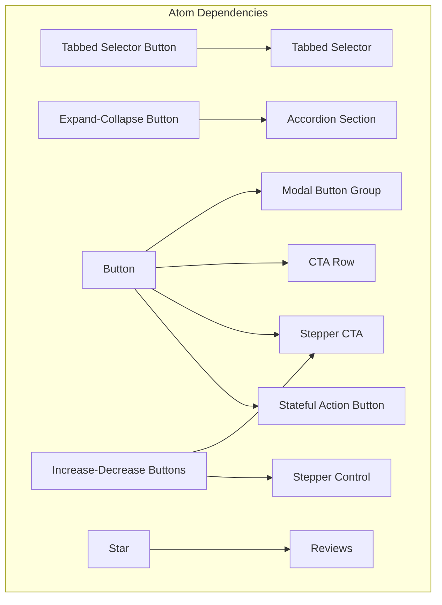

# 06 · Component Dependency Graph

> Initial mappings inferred from component names and Figma section hierarchy. Refine as needed.

## Full Hierarchy

```mermaid
graph TD
  subgraph htmlElements ["HTML Elements"]
    button["&lt;button&gt;"]
    nav["&lt;nav&gt;"]
    select["&lt;select&gt;"]
    input_type_range_["&lt;input[type=range]&gt;"]
    div["&lt;div&gt;"]
    dialog["&lt;dialog&gt;"]
    details["&lt;details&gt;"]
    output["&lt;output&gt;"]
    section["&lt;section&gt;"]
    article["&lt;article&gt;"]
    form["&lt;form&gt;"]
    input_type_checkbox_["&lt;input[type=checkbox]&gt;"]
    input["&lt;input&gt;"]
    input_type_radio_["&lt;input[type=radio]&gt;"]
    input_type_file_["&lt;input[type=file]&gt;"]
    span["&lt;span&gt;"]
    img["&lt;img&gt;"]
    ul["&lt;ul&gt;"]
  end
  subgraph atomsGroup ["Atoms"]
    Button["Button"]
    Next_Previous_Buttons["Next-Previous Buttons"]
    Increase_Decrease_Buttons["Increase-Decrease Buttons"]
    Expand_Collapse_Button["Expand-Collapse Button"]
    Close_Button["Close Button"]
    Text_Button_Icon_Right["Text Button—Icon Right"]
    Text_Button_Icon_Left["Text Button—Icon Left"]
    Floating_Action_Button["Floating Action Button"]
    Play_Button["Play Button"]
    Breadcrumbs["Breadcrumbs"]
    Simple_Menu["Simple Menu"]
    Button_Menu["Button Menu"]
    Tabbed_Selector_Button["Tabbed Selector Button"]
    Floating_Action_Button_with_Text["Floating Action Button with Text"]
    Slider_Scroll_Bar["Slider Scroll Bar"]
    Next_Previous_Selector["Next-Previous Selector"]
    Stepper_Control["Stepper Control"]
    Stepper_CTA["Stepper CTA"]
    Star["Star"]
    Tabbed_Selector["Tabbed Selector"]
    Reviews["Reviews"]
    CTA_Row["CTA Row"]
    Category_Button["Category Button"]
    Modal_Button_Group["Modal Button Group"]
    Accordion_Section["Accordion Section"]
    Subnav_Dropdown_Options["Subnav Dropdown Options"]
    Stateful_Action_Button["Stateful Action Button"]
  end
  subgraph moleculesGroup ["Molecules"]
    Toast_Bar["Toast Bar"]
    Button_group["Button group"]
    Text_Section_with_Button_Group["Text Section with Button Group"]
    Text_Section["Text Section"]
    Free_Trial_Card["Free Trial Card"]
    Product_Content["Product Content"]
    Slider_page_selector["Slider page selector"]
    Carousel_Product["Carousel Product"]
    Section_Headline_with_CTA["Section Headline with CTA"]
    Section_Headline["Section Headline"]
    Basic_Form["Basic Form"]
    Multi_CTA_List["Multi-CTA List"]
    Product_Grid_Card["Product Grid Card"]
    Modal_Dialog["Modal Dialog"]
    Product_Lineup_Single["Product Lineup—Single"]
    Subnav_Dropdown["Subnav Dropdown"]
  end
  subgraph inputsGroup ["Inputs"]
    Checkbox["Checkbox"]
    Switch["Switch"]
    Text_Input__single_line_["Text Input (single line)"]
    Text_Input__name__two_fields_["Text Input (name, two fields)"]
    Radio_Button["Radio Button"]
    Multi_Select_with_Text["Multi-Select with Text"]
    Toggle_with_Text["Toggle with Text"]
    Upload_Image_Area["Upload Image Area"]
    Toggle_Switch__text_["Toggle Switch (text)"]
    Text_Input_Multiline["Text Input—Multiline"]
    Dropdown["Dropdown"]
    Form_Dropdown["Form Dropdown"]
    Multi_Selector["Multi-Selector"]
    Text_Toggle_Selector["Text Toggle Selector"]
    Text_Toggle_Selector["Text Toggle Selector"]
    Text_Input_Date["Text Input—Date"]
    Text_Input_Password["Text Input—Password"]
    Slider["Slider"]
    Search_Field["Search Field"]
    Email_Capture["Email Capture"]
    Form_Dropdown_Option["Form Dropdown Option"]
    Single_Select_Box["Single Select Box"]
  end

  %% HTML to Atom connections
  button --> Button
  button --> Next_Previous_Buttons
  button --> Increase_Decrease_Buttons
  button --> Expand_Collapse_Button
  button --> Close_Button
  button --> Text_Button_Icon_Right
  button --> Text_Button_Icon_Left
  button --> Floating_Action_Button
  button --> Play_Button
  nav --> Breadcrumbs
  nav --> Simple_Menu
  nav --> Button_Menu
  select --> Tabbed_Selector_Button
  button --> Floating_Action_Button_with_Text
  input_type_range_ --> Slider_Scroll_Bar
  select --> Next_Previous_Selector
  button --> Stepper_Control
  button --> Stepper_CTA
  button --> Star
  select --> Tabbed_Selector
  div --> Reviews
  button --> CTA_Row
  button --> Category_Button
  dialog --> Modal_Button_Group
  details --> Accordion_Section
  select --> Subnav_Dropdown_Options
  button --> Stateful_Action_Button
  input_type_checkbox_ --> Checkbox
  input_type_checkbox_ --> Switch
  input --> Text_Input__single_line_
  input --> Text_Input__name__two_fields_
  input_type_radio_ --> Radio_Button
  select --> Multi_Select_with_Text
  input_type_checkbox_ --> Toggle_with_Text
  input_type_file_ --> Upload_Image_Area
  input_type_checkbox_ --> Toggle_Switch__text_
  input --> Text_Input_Multiline
  select --> Dropdown
  select --> Form_Dropdown
  select --> Multi_Selector
  select --> Text_Toggle_Selector
  select --> Text_Toggle_Selector
  input --> Text_Input_Date
  input --> Text_Input_Password
  input_type_range_ --> Slider
  input --> Search_Field
  input --> Email_Capture
  select --> Form_Dropdown_Option
  select --> Single_Select_Box

  %% Atom/Input to Molecule connections
  Close_Button --> Toast_Bar
  Button --> Text_Section_with_Button_Group
  Text_Button_Icon_Right --> Text_Section_with_Button_Group
  Button --> Free_Trial_Card
  Stepper_CTA --> Free_Trial_Card
  Button --> Product_Content
  Stepper_CTA --> Product_Content
  Reviews --> Product_Content
  Badges_and_Tags --> Product_Content
  Price_and_Label --> Product_Content
  Next_Previous_Selector --> Slider_page_selector
  Slider_Scroll_Bar --> Slider_page_selector
  Next_Previous_Buttons --> Carousel_Product
  Slider_Scroll_Bar --> Carousel_Product
  Slider_page_selector --> Carousel_Product
  Button --> Section_Headline_with_CTA
  Text_Button_Icon_Right --> Section_Headline_with_CTA
  Text_Input__single_line_ --> Basic_Form
  Dropdown --> Basic_Form
  Checkbox --> Basic_Form
  Radio_Button --> Basic_Form
  Button --> Basic_Form
  CTA_Row --> Multi_CTA_List
  Button --> Product_Grid_Card
  Badges_and_Tags --> Product_Grid_Card
  Price_and_Label --> Product_Grid_Card
  Reviews --> Product_Grid_Card
  Button --> Modal_Dialog
  Close_Button --> Modal_Dialog
  Modal_Button_Group --> Modal_Dialog
  Button --> Product_Lineup_Single
  Stepper_CTA --> Product_Lineup_Single
  Reviews --> Product_Lineup_Single
  Badges_and_Tags --> Product_Lineup_Single
  Price_and_Label --> Product_Lineup_Single
  Subnav_Dropdown_Options --> Subnav_Dropdown
```

## Atoms with Internal Dependencies

## Molecule → Atom Dependencies

| Molecule | Depends On |
|----------|------------|
| Basic Form | Text Input (single line), Dropdown, Checkbox, Radio Button, Button |
| Button group | — |
| Carousel Product | Next-Previous Buttons, Slider Scroll Bar, Slider page selector |
| Free Trial Card | Button, Stepper CTA |
| Modal Dialog | Button, Close Button, Modal Button Group |
| Multi-CTA List | CTA Row |
| Product Content | Button, Stepper CTA, Reviews, Badges and Tags, Price and Label |
| Product Grid Card | Button, Badges and Tags, Price and Label, Reviews |
| Product Lineup—Single | Button, Stepper CTA, Reviews, Badges and Tags, Price and Label |
| Section Headline | — |
| Section Headline with CTA | Button, Text Button—Icon Right |
| Slider page selector | Next-Previous Selector, Slider Scroll Bar |
| Subnav Dropdown | Subnav Dropdown Options |
| Text Section | — |
| Text Section with Button Group | Button, Text Button—Icon Right |
| Toast Bar | Close Button |

---
*Generated by `build-inventory.ts`*