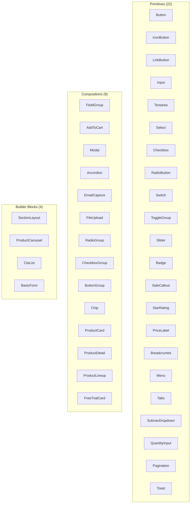
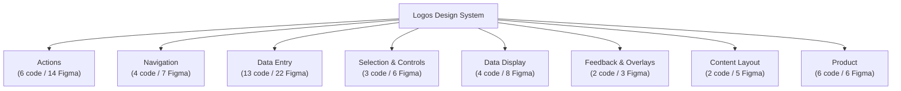

# 08 · Functional Taxonomy

> **Three-axis classification:** Atomic level (Figma) · Functional category (purpose) · Component tier (code architecture).

## Component Tiers

> The tier determines the file structure, Builder.io registration requirement, and how content authors interact with the component.

| Tier | Description | Builder.io | File Structure |
|------|-------------|------------|----------------|
| **Primitive** | Standalone React component. No Builder.io dependency in `component.tsx`. | Optional `register.tsx` | `component.tsx`, `register.tsx`, `component.test.tsx`, `index.ts` |
| **Composition** | Multi-primitive React component, React-first. May use `BuilderBlocks` for editable slots. | `register.tsx` recommended | Same as primitive |
| **Builder Block** | Page-level composition primarily consumed via Builder.io. `BuilderBlocks` required for content areas. | `register.tsx` required | Same + default block values in `register.tsx` |

## Code Component Architecture



## Category Overview



## Category Definitions

### Actions

> Buttons and interactive controls that trigger an operation or navigate.

**Code components:**

| Code Component | Tier | Figma Sources |
|----------------|------|---------------|
| `Button` | Primitive | Button, Floating Action Button with Text, Stateful Action Button |
| `IconButton` | Primitive | Close Button, Play Button, Floating Action Button, Expand-Collapse Button, Increase-Decrease Buttons, Next-Previous Buttons |
| `LinkButton` | Primitive | Text Button—Icon Left, Text Button—Icon Right |
| `AddToCart` | Composition | Stepper CTA |
| `ButtonGroup` | Composition | Button group, CTA Row |
| `Chip` | Composition | Category Button |

### Navigation

> Components that help users move between pages, sections, or states.

**Code components:**

| Code Component | Tier | Figma Sources |
|----------------|------|---------------|
| `Breadcrumbs` | Primitive | Breadcrumbs |
| `Menu` | Primitive | Simple Menu, Button Menu |
| `Tabs` | Primitive | Tabbed Selector, Tabbed Selector Button |
| `SubnavDropdown` | Primitive | Subnav Dropdown, Subnav Dropdown Options |

### Data Entry

> Form controls that capture user input.

**Code components:**

| Code Component | Tier | Figma Sources |
|----------------|------|---------------|
| `Input` | Primitive | Text Input (single line), Text Input—Date, Text Input—Password, Search Field |
| `Textarea` | Primitive | Text Input—Multiline |
| `FieldGroup` | Composition | Text Input (name, two fields), Text Toggle Selector |
| `Select` | Primitive | Dropdown, Form Dropdown, Form Dropdown Option |
| `Checkbox` | Primitive | Checkbox, Single Select Box |
| `RadioButton` | Primitive | Radio Button |
| `Slider` | Primitive | Slider |
| `QuantityInput` | Primitive | Stepper Control |
| `EmailCapture` | Composition | Email Capture |
| `FileUpload` | Composition | Upload Image Area |
| `RadioGroup` | Composition | Multi-Selector, Multi-Select with Text |
| `CheckboxGroup` | Composition | Multi-Selector, Multi-Select with Text, Single Select Box |
| `BasicForm` | Builder Block | Basic Form |

### Selection & Controls

> Controls for choosing values, navigating ranges, or toggling options.

**Code components:**

| Code Component | Tier | Figma Sources |
|----------------|------|---------------|
| `Switch` | Primitive | Switch, Toggle with Text |
| `ToggleGroup` | Primitive | Toggle Switch (text) |
| `Pagination` | Primitive | Next-Previous Selector, Slider page selector, Slider Scroll Bar |

### Data Display

> Read-only components that present information or status.

**Code components:**

| Code Component | Tier | Figma Sources |
|----------------|------|---------------|
| `Badge` | Primitive | Badges and Tags |
| `SaleCallout` | Primitive | Sale Percentage |
| `StarRating` | Primitive | Star, Reviews |
| `PriceLabel` | Primitive | Price and Label |

### Feedback & Overlays

> Components that communicate system state or require user acknowledgment.

**Code components:**

| Code Component | Tier | Figma Sources |
|----------------|------|---------------|
| `Toast` | Primitive | Toast Bar |
| `Modal` | Composition | Modal Dialog, Modal Button Group |

### Content Layout

> Structural components that arrange and present content sections.

**Code components:**

| Code Component | Tier | Figma Sources |
|----------------|------|---------------|
| `Accordion` | Composition | Accordion Section |
| `SectionLayout` | Builder Block | Section Headline, Section Headline with CTA, Text Section, Text Section with Button Group |

### Product

> Commerce-specific compositions for displaying and selling products.

**Code components:**

| Code Component | Tier | Figma Sources |
|----------------|------|---------------|
| `ProductCard` | Composition | Product Grid Card |
| `ProductDetail` | Composition | Product Content |
| `ProductLineup` | Composition | Product Lineup—Single |
| `FreeTrialCard` | Composition | Free Trial Card |
| `ProductCarousel` | Builder Block | Carousel Product |
| `CtaList` | Builder Block | Multi-CTA List |

## Triple-Axis Classification

Every Figma frame mapped to its atomic level, functional category, and code component tier.

| Figma Frame | Atomic Level | Functional Category | Code Component | Tier |
|-------------|-------------|---------------------|----------------|------|
| Accordion Section | Atoms | Content Layout | `Accordion` | Composition |
| Badges and Tags | Other | Data Display | `Badge` | Primitive |
| Basic Form | Molecules | Data Entry | `BasicForm` | Builder Block |
| Breadcrumbs | Atoms | Navigation | `Breadcrumbs` | Primitive |
| Button | Atoms | Actions | `Button` | Primitive |
| Button group | Molecules | Selection & Controls | `ButtonGroup` | Composition |
| Button Menu | Atoms | Navigation | `Menu` | Primitive |
| Carousel Product | Molecules | Product | `ProductCarousel` | Builder Block |
| Category Button | Atoms | Actions | `Chip` | Composition |
| Checkbox | Inputs & Forms | Data Entry | `Checkbox` | Primitive |
| Close Button | Atoms | Actions | `IconButton` | Primitive |
| CTA Row | Atoms | Actions | `ButtonGroup` | Composition |
| Dropdown | Inputs & Forms | Data Entry | `Select` | Primitive |
| Email Capture | Inputs & Forms | Data Entry | `EmailCapture` | Composition |
| Expand-Collapse Button | Atoms | Actions | `IconButton` | Primitive |
| Floating Action Button | Atoms | Actions | `IconButton` | Primitive |
| Floating Action Button with Text | Atoms | Actions | `Button` | Primitive |
| Form Dropdown | Inputs & Forms | Data Entry | `Select` | Primitive |
| Form Dropdown Option | Inputs & Forms | Data Entry | `Select` | Primitive |
| Free Trial Card | Molecules | Product | `FreeTrialCard` | Composition |
| Image Ratios | Other | Data Display | — | — |
| Increase-Decrease Buttons | Atoms | Actions | `IconButton` | Primitive |
| List | Other | Data Display | — | — |
| Modal Button Group | Atoms | Feedback & Overlays | `Modal` | Composition |
| Modal Dialog | Molecules | Feedback & Overlays | `Modal` | Composition |
| Multi-CTA List | Molecules | Product | `CtaList` | Builder Block |
| Multi-Select with Text | Inputs & Forms | Data Entry | `RadioGroup` | Composition |
| Multi-Selector | Inputs & Forms | Data Entry | `RadioGroup` | Composition |
| Next-Previous Buttons | Atoms | Actions | `IconButton` | Primitive |
| Next-Previous Selector | Atoms | Selection & Controls | `Pagination` | Primitive |
| Play Button | Atoms | Actions | `IconButton` | Primitive |
| Price and Label | Other | Data Display | `PriceLabel` | Primitive |
| Product Content | Molecules | Product | `ProductDetail` | Composition |
| Product Grid Card | Molecules | Product | `ProductCard` | Composition |
| Product Images | Other | Data Display | — | — |
| Product Lineup—Single | Molecules | Product | `ProductLineup` | Composition |
| Radio Button | Inputs & Forms | Data Entry | `RadioButton` | Primitive |
| Reviews | Atoms | Data Display | `StarRating` | Primitive |
| Sale Percentage | Other | Data Display | `SaleCallout` | Primitive |
| Search Field | Inputs & Forms | Data Entry | `Input` | Primitive |
| Section Headline | Molecules | Content Layout | `SectionLayout` | Builder Block |
| Section Headline with CTA | Molecules | Content Layout | `SectionLayout` | Builder Block |
| Simple Menu | Atoms | Navigation | `Menu` | Primitive |
| Single Select Box | Inputs & Forms | Data Entry | `Checkbox` | Primitive |
| Slider | Inputs & Forms | Data Entry | `Slider` | Primitive |
| Slider page selector | Molecules | Selection & Controls | `Pagination` | Primitive |
| Slider Scroll Bar | Atoms | Selection & Controls | `Pagination` | Primitive |
| Star | Atoms | Data Display | `StarRating` | Primitive |
| Stateful Action Button | Atoms | Actions | `Button` | Primitive |
| Stepper Control | Atoms | Data Entry | `QuantityInput` | Primitive |
| Stepper CTA | Atoms | Actions | `AddToCart` | Composition |
| Subnav Dropdown | Molecules | Navigation | `SubnavDropdown` | Primitive |
| Subnav Dropdown Options | Atoms | Navigation | `SubnavDropdown` | Primitive |
| Switch | Inputs & Forms | Data Entry | `Switch` | Primitive |
| Tabbed Selector | Atoms | Navigation | `Tabs` | Primitive |
| Tabbed Selector Button | Atoms | Navigation | `Tabs` | Primitive |
| Text Button—Icon Left | Atoms | Actions | `LinkButton` | Primitive |
| Text Button—Icon Right | Atoms | Actions | `LinkButton` | Primitive |
| Text Input (name, two fields) | Inputs & Forms | Data Entry | `FieldGroup` | Composition |
| Text Input (single line) | Inputs & Forms | Data Entry | `Input` | Primitive |
| Text Input—Date | Inputs & Forms | Data Entry | `Input` | Primitive |
| Text Input—Multiline | Inputs & Forms | Data Entry | `Textarea` | Primitive |
| Text Input—Password | Inputs & Forms | Data Entry | `Input` | Primitive |
| Text Section | Molecules | Content Layout | `SectionLayout` | Builder Block |
| Text Section with Button Group | Molecules | Content Layout | `SectionLayout` | Builder Block |
| Text Toggle Selector | Inputs & Forms | Data Entry | `FieldGroup` | Composition |
| Text Toggle Selector | Inputs & Forms | Data Entry | `FieldGroup` | Composition |
| Toast Bar | Molecules | Feedback & Overlays | `Toast` | Primitive |
| Toggle Switch (text) | Inputs & Forms | Selection & Controls | `ToggleGroup` | Primitive |
| Toggle with Text | Inputs & Forms | Selection & Controls | `Switch` | Primitive |
| Upload Image Area | Inputs & Forms | Data Entry | `FileUpload` | Composition |

## Proposed Code Folder Structure

Follows the existing `commerce-components` convention: kebab-case directory per component, `component.tsx` / `register.tsx` / `component.test.tsx` / `index.ts`.

```
packages/commerce-components/src/components/
  # Primitives
  button/
    component.tsx   # React component — no Builder.io imports
    register.tsx    # Builder.io registration only
    component.test.tsx
    index.ts        # barrel re-export
  input/
  textarea/
  select/
  checkbox/
  radio-button/
  switch/
  toggle-group/
  slider/
  badge/
  sale-callout/
  star-rating/
  price-label/
  breadcrumbs/
  menu/
  tabs/
  subnav-dropdown/
  quantity-input/
  pagination/
  toast/
  # Compositions (React-first, Builder.io optional)
  field-group/
  modal/
  accordion/
  email-capture/
  file-upload/
  radio-group/
  checkbox-group/
  button-group/
  chip/
  product-card/
  product-detail/
  product-lineup/
  free-trial-card/
  # Builder Blocks (require register.tsx with BuilderBlocks)
  section-layout/
  product-carousel/
  cta-list/
  basic-form/
```

## Note on "Other" Figma Section

The 6 components in Figma's "Other" section are reclassified as follows:

| Figma Frame | Functional Category | Code Component | Rationale |
|-------------|---------------------|----------------|-----------|
| Badges and Tags | Data Display | `Badge` | Standalone display atom |
| Product Images | Data Display | — | Commerce display atom |
| Price and Label | Data Display | `PriceLabel` | Commerce display atom |
| Image Ratios | Data Display | — | Layout constraint — consider removing from component inventory |
| Sale Percentage | Data Display | `SaleCallout` | Badge variant for promotional pricing |
| List | Data Display | — | Generic atom used inside content sections |

---
*Generated by `build-inventory.ts`*