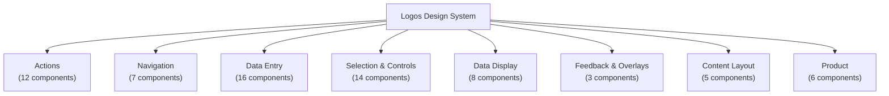

# 08 · Functional Taxonomy

> A two-axis classification: **Atomic level** (Atom/Molecule/Input/Other) from Figma section · **Functional category** (what the component does) proposed for code organization.

## Category Overview



## Category Definitions

### Actions (12)

> Buttons and interactive controls that trigger an operation or navigate.

- Button
- CTA Row
- Category Button
- Close Button
- Floating Action Button
- Floating Action Button with Text
- Play Button
- Stateful Action Button
- Stepper CTA
- Stepper Control
- Text Button—Icon Left
- Text Button—Icon Right

### Navigation (7)

> Components that help users move between pages, sections, or states.

- Breadcrumbs
- Button Menu
- Simple Menu
- Subnav Dropdown
- Subnav Dropdown Options
- Tabbed Selector
- Tabbed Selector Button

### Data Entry (16)

> Form controls that capture user input.

- Basic Form
- Checkbox
- Dropdown
- Email Capture
- Form Dropdown
- Form Dropdown Option
- Radio Button
- Search Field
- Slider
- Switch
- Text Input (name, two fields)
- Text Input (single line)
- Text Input—Date
- Text Input—Multiline
- Text Input—Password
- Upload Image Area

### Selection & Controls (14)

> Controls for choosing values, navigating ranges, or toggling options.

- Button group
- Expand-Collapse Button
- Increase-Decrease Buttons
- Multi-Select with Text
- Multi-Selector
- Next-Previous Buttons
- Next-Previous Selector
- Single Select Box
- Slider Scroll Bar
- Slider page selector
- Text Toggle Selector
- Text Toggle Selector
- Toggle Switch (text)
- Toggle with Text

### Data Display (8)

> Read-only components that present information or status.

- Badges and Tags
- Image Ratios
- List
- Price and Label
- Product Images
- Reviews
- Sale Percentage
- Star

### Feedback & Overlays (3)

> Components that communicate system state or require user acknowledgment.

- Modal Button Group
- Modal Dialog
- Toast Bar

### Content Layout (5)

> Structural components that arrange and present content sections.

- Accordion Section
- Section Headline
- Section Headline with CTA
- Text Section
- Text Section with Button Group

### Product (6)

> Commerce-specific compositions for displaying and selling products.

- Carousel Product
- Free Trial Card
- Multi-CTA List
- Product Content
- Product Grid Card
- Product Lineup—Single

## Dual-Axis Classification

Every component mapped to both its Figma atomic level and proposed functional category.

| Component | Atomic Level | Functional Category | Proposed Code Name |
|-----------|-------------|--------------------|--------------------|
| Accordion Section | Atoms | Content Layout | `Accordion` |
| Badges and Tags | Other | Data Display | `Badge` |
| Basic Form | Molecules | Data Entry | `Form` |
| Breadcrumbs | Atoms | Navigation | `Breadcrumbs` |
| Button | Atoms | Actions | `Button` |
| Button group | Molecules | Selection & Controls | `ButtonGroup` |
| Button Menu | Atoms | Navigation | `ButtonMenu` |
| Carousel Product | Molecules | Product | `ProductCarousel` |
| Category Button | Atoms | Actions | `CategoryButton` |
| Checkbox | Inputs & Forms | Data Entry | `Checkbox` |
| Close Button | Atoms | Actions | `CloseButton` |
| CTA Row | Atoms | Actions | `CtaRow` |
| Dropdown | Inputs & Forms | Data Entry | `Dropdown` |
| Email Capture | Inputs & Forms | Data Entry | `EmailCaptureField` |
| Expand-Collapse Button | Atoms | Selection & Controls | `ExpandCollapseButton` |
| Floating Action Button | Atoms | Actions | `FloatingActionButton` |
| Floating Action Button with Text | Atoms | Actions | `FloatingActionButtonLabel` |
| Form Dropdown | Inputs & Forms | Data Entry | `FormDropdown` |
| Form Dropdown Option | Inputs & Forms | Data Entry | `DropdownOption` |
| Free Trial Card | Molecules | Product | `FreeTrialCard` |
| Image Ratios | Other | Data Display | `ImageContainer` |
| Increase-Decrease Buttons | Atoms | Selection & Controls | `QuantityButtons` |
| List | Other | Data Display | `List` |
| Modal Button Group | Atoms | Feedback & Overlays | `ModalButtonGroup` |
| Modal Dialog | Molecules | Feedback & Overlays | `Modal` |
| Multi-CTA List | Molecules | Product | `CtaList` |
| Multi-Select with Text | Inputs & Forms | Selection & Controls | `MultiSelect` |
| Multi-Selector | Inputs & Forms | Selection & Controls | `MultiSelector` |
| Next-Previous Buttons | Atoms | Selection & Controls | `PreviousNextButtons` |
| Next-Previous Selector | Atoms | Selection & Controls | `PreviousNextSelector` |
| Play Button | Atoms | Actions | `PlayButton` |
| Price and Label | Other | Data Display | `PriceLabel` |
| Product Content | Molecules | Product | `ProductContent` |
| Product Grid Card | Molecules | Product | `ProductCard` |
| Product Images | Other | Data Display | `ProductImage` |
| Product Lineup—Single | Molecules | Product | `ProductLineup` |
| Radio Button | Inputs & Forms | Data Entry | `RadioButton` |
| Reviews | Atoms | Data Display | `ReviewRating` |
| Sale Percentage | Other | Data Display | `SaleBadge` |
| Search Field | Inputs & Forms | Data Entry | `SearchField` |
| Section Headline | Molecules | Content Layout | `SectionHeadline` |
| Section Headline with CTA | Molecules | Content Layout | `SectionHeadlineWithCta` |
| Simple Menu | Atoms | Navigation | `SimpleMenu` |
| Single Select Box | Inputs & Forms | Selection & Controls | `SelectBox` |
| Slider | Inputs & Forms | Data Entry | `Slider` |
| Slider page selector | Molecules | Selection & Controls | `PageSelector` |
| Slider Scroll Bar | Atoms | Selection & Controls | `ScrollBar` |
| Star | Atoms | Data Display | `StarIcon` |
| Stateful Action Button | Atoms | Actions | `StatefulButton` |
| Stepper Control | Atoms | Actions | `StepperControl` |
| Stepper CTA | Atoms | Actions | `StepperCta` |
| Subnav Dropdown | Molecules | Navigation | `SubnavDropdown` |
| Subnav Dropdown Options | Atoms | Navigation | `SubnavDropdownOption` |
| Switch | Inputs & Forms | Data Entry | `Switch` |
| Tabbed Selector | Atoms | Navigation | `TabbedSelector` |
| Tabbed Selector Button | Atoms | Navigation | `TabbedSelectorTab` |
| Text Button—Icon Left | Atoms | Actions | `TextButtonIconLeft` |
| Text Button—Icon Right | Atoms | Actions | `TextButtonIconRight` |
| Text Input (name, two fields) | Inputs & Forms | Data Entry | `TextInputGroup` |
| Text Input (single line) | Inputs & Forms | Data Entry | `TextInput` |
| Text Input—Date | Inputs & Forms | Data Entry | `DateInput` |
| Text Input—Multiline | Inputs & Forms | Data Entry | `Textarea` |
| Text Input—Password | Inputs & Forms | Data Entry | `PasswordInput` |
| Text Section | Molecules | Content Layout | `TextSection` |
| Text Section with Button Group | Molecules | Content Layout | `TextSectionWithButtons` |
| Text Toggle Selector | Inputs & Forms | Selection & Controls | `TextToggleSelector` |
| Text Toggle Selector | Inputs & Forms | Selection & Controls | `TextToggleSelector` |
| Toast Bar | Molecules | Feedback & Overlays | `Toast` |
| Toggle Switch (text) | Inputs & Forms | Selection & Controls | `ToggleGroup` |
| Toggle with Text | Inputs & Forms | Selection & Controls | `Toggle` |
| Upload Image Area | Inputs & Forms | Data Entry | `FileUpload` |

## Proposed Code Folder Structure

Based on the functional taxonomy, components should be organized as follows in `CommerceComponents/packages/`:

```
src/
  actions/
    Button/
    TextButtonIconRight/
    TextButtonIconLeft/
    CloseButton/
    FloatingActionButton/
    FloatingActionButtonLabel/
    PlayButton/
    CategoryButton/
    CtaRow/
    StatefulButton/
    StepperCta/
    StepperControl/
  navigation/
    Breadcrumbs/
    SimpleMenu/
    ButtonMenu/
    TabbedSelector/
    TabbedSelectorTab/
    SubnavDropdown/
    SubnavDropdownOption/
  data-entry/
    TextInput/
    TextInputGroup/
    DateInput/
    Textarea/
    PasswordInput/
    Dropdown/
    FormDropdown/
    DropdownOption/
    Checkbox/
    RadioButton/
    Switch/
    SearchField/
    EmailCaptureField/
    FileUpload/
    Slider/
    Form/
  selection/
    PreviousNextButtons/
    PreviousNextSelector/
    QuantityButtons/
    ExpandCollapseButton/
    ScrollBar/
    PageSelector/
    ButtonGroup/
    MultiSelect/
    MultiSelector/
    ToggleGroup/
    Toggle/
    TextToggleSelector/
    SelectBox/
  data-display/
    Badge/
    PriceLabel/
    SaleBadge/
    ReviewRating/
    StarIcon/
    ProductImage/
    ImageContainer/
    List/
  feedback/
    Toast/
    Modal/
    ModalButtonGroup/
  content-layout/
    SectionHeadline/
    SectionHeadlineWithCta/
    TextSection/
    TextSectionWithButtons/
    Accordion/
  product/
    ProductContent/
    ProductCard/
    ProductLineup/
    FreeTrialCard/
    ProductCarousel/
    CtaList/
```

## Note on "Other" Reclassification

The 6 components currently in Figma's "Other" section are assigned functional categories as follows:

| Component | Proposed Category | Rationale |
|-----------|------------------|-----------|
| Badges and Tags | Data Display | Standalone display element — atom-level data display |
| Product Images | Data Display | Commerce-specific image display atom |
| Price and Label | Data Display | Commerce-specific display atom showing price info |
| Image Ratios | Data Display | Layout constraint helper, not a component — consider removing from inventory |
| Sale Percentage | Data Display | Badge variant for promotional pricing |
| List | Data Display | Generic layout/text atom used inside content sections |

---
*Generated by `build-inventory.ts`*