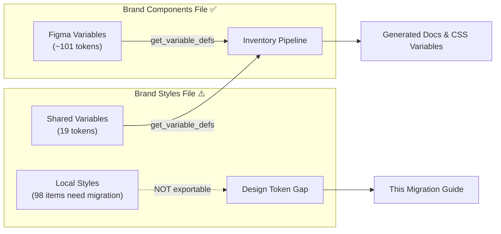

# 11 — Design Token Migration Guide

> **Audience:** Design team (Figma).
> **Purpose:** This document identifies every value in the Logos Brand Styles file that exists as a **local style** rather than a **Figma variable**. Local styles cannot be exported as W3C Design Tokens — they are invisible to the token pipeline. Each item below is an action for the design team to complete before it will appear in generated documentation and CSS.

---

## A. The Problem: Local Styles vs. Variables

Figma has two systems for reusable values:

| System | Exportable as DTCG token? | Supports modes/themes? | Status |
|---|---|---|---|
| **Figma Variables** (new) | ✅ Yes | ✅ Yes | Path forward |
| **Figma Local Styles** (legacy) | ❌ No | ❌ No | Needs migration |

When the MCP tool `get_variable_defs` is called on the Brand Styles file, it returns only the values that are **Figma Variables** — roughly 8 values shared from the Brand Components library. Everything else (colors, shadows, gradients, typography) is defined as a **local style** and is invisible to the export pipeline.



---

## B. Migration Summary

| Metric | Count |
|---|---|
| Total items audited | **126** |
| ✅ Already a Figma variable (no action needed) | **19** |
| 🔴 Local style only — **needs migration to variable** | **98** |
| 🟡 Duplicate — same value exists as variable under different name | **9** |

### By Type

| Type | Local Style Only | Duplicates | Variables |
|---|---|---|---|
| Colors | 34 | 4 | 15 |
| Shadows | 19 | 0 | 4 |
| Gradients | 5 | 0 | 0 |
| Typography | 40 | 5 | 0 |

### By Priority (items needing migration only)

| Priority | Count | What it means |
|---|---|---|
| 🚨 Critical | 0 | Used by components — blocking design-to-code connection |
| 🔶 High | 33 | Core palette — high visibility, used in many places |
| 🔷 Medium | 55 | Secondary colors, extended shadow scale |
| ⚪ Low | 10 | Sub-brand (Verbum), gradients, legacy typography variants |

---

## C. Migration Checklist by Type

### C1. Colors — Needs Migration (34 items)

#### Primary & Secondary Palette Gaps (2 items)

These are the most critical — they are part of the core color system but not yet variables.

| Style Name | Value | Priority | Notes |
|---|---|---|---|
| Secondary/Deep Blue 3 |  `#3640B8` | 🔶 high | — |
| Secondary/Light Blue 0 |  `#9BCDFF` | 🔶 high | — |

#### Deep & Bright Colors + Neutral Gaps (10 items)

| Style Name | Value | Priority | Notes |
|---|---|---|---|
| Deep Colors/Deep Orange |  `#AD4100` | 🔶 high | — |
| Deep Colors/Deep Purple |  `#502D4C` | 🔶 high | — |
| Bright Colors/Alt Orange |  `#D87C44` | 🔷 medium | — |
| Bright Colors/Alt Purple |  `#A4619C` | 🔷 medium | — |
| Bright Colors/Bright Green |  `#54EB54` | 🔷 medium | — |
| Neutral/Gray 1 |  `#F5F5F5` | 🔶 high | Same as Core Swatches/Gray 1 - consolidate into one variable |
| Neutral/Gray 2 |  `#EBEBEB` | 🔶 high | Same as Core Swatches/Gray 2 - consolidate |
| Neutral/Gray 3 |  `#DBDBDB` | 🔶 high | Same as Core Swatches/Gray 3 - consolidate |
| Neutral/Gray 4 |  `#C7C7C7` | 🔶 high | Same as Core Swatches/Gray 4 - consolidate |
| Neutral/Black |  `#000000` | 🔶 high | — |

#### Legacy Swatch Groups (13 items)

These are legacy groups (Core Swatches, Logos Swatches) that predate the current variable structure. Some values are unique (need new variables); others are duplicates of existing values under different names.

| Style Name | Value | Priority | Notes |
|---|---|---|---|
| Core Swatches/Gray 1 |  `#F5F5F5` | 🔷 medium | Same value as Neutral/Gray 1 — consolidate |
| Core Swatches/Gray 2 |  `#EBEBEB` | 🔷 medium | Same value as Neutral/Gray 2 — consolidate |
| Core Swatches/Gray 3 |  `#DBDBDB` | 🔷 medium | Same value as Neutral/Gray 3 — consolidate |
| Core Swatches/Gray 4 |  `#C7C7C7` | 🔷 medium | Same value as Neutral/Gray 4 — consolidate |
| Core Swatches/Dark Gray |  `#3D3D3D` | 🔷 medium | Different from Secondary/Very Deep Gray (#303030) |
| Core Swatches/Black |  `#000000` | 🔷 medium | Same value as Neutral/Black — consolidate |
| Core Swatches/Dark Blue |  `#06296C` | 🔷 medium | — |
| Core Swatches/Logos Blue |  `#005EC3` | 🔷 medium | DIFFERENT from Primary/Logos Blue (#1E6AFE) - legacy value |
| Core Swatches/Logos Top Blue |  `#509EE5` | 🔷 medium | — |
| Logos Swatches/Faithlife Blue |  `#1E91D6` | 🔷 medium | — |
| Logos Swatches/Light Blue |  `#D8EFFC` | 🔷 medium | — |
| Logos Swatches/Faithlife Green |  `#62BB46` | 🔷 medium | — |
| Logos Swatches/Red |  `#970101` | 🔷 medium | — |

#### Verbum Sub-Brand Colors (9 items)

Sub-brand colors — only needed if Verbum brand is actively maintained in this file.

| Style Name | Value | Priority | Notes |
|---|---|---|---|
| Verbum/Verbum White |  `#FFFFFF` | ⚪ low | — |
| Verbum/Verbum Dk Blue |  `#003C71` | ⚪ low | — |
| Verbum/Verbum Lt Blue |  `#61B5E4` | ⚪ low | — |
| Verbum/Verbum Blue |  `#0072CE` | ⚪ low | — |
| Verbum/Verbum Pale Blue |  `#DBF1FC` | ⚪ low | — |
| Verbum/Verbum Dk Grey |  `#666666` | ⚪ low | — |
| Verbum/Verbum Grey |  `#CCCCCC` | ⚪ low | — |
| Verbum/Dark Grey |  `#3D3D3D` | ⚪ low | Same value as Core Swatches/Dark Gray — consolidate |
| Verbum/Verbum Soft Black |  `#121212` | ⚪ low | — |

### C2. Shadows — Needs Migration (19 items)

Currently only **Shadows/4dp** and **Shadows/6dp** are Figma variables. The full elevation scale and the entire "Shadows - L9" alternate set need to be converted.

| Style Name | Priority | Notes |
|---|---|---|
| Shadows/1dp | 🔶 high | Needs variable definition |
| Shadows/2dp | 🔶 high | Needs variable definition |
| Shadows/3dp | 🔶 high | Needs variable definition |
| Shadows/8dp | 🔶 high | Needs variable definition |
| Shadows/9dp | 🔶 high | Needs variable definition |
| Shadows/12dp | 🔶 high | Needs variable definition |
| Shadows/16dp | 🔶 high | Needs variable definition |
| Shadows/24dp | 🔶 high | Needs variable definition |
| Shadows - L9/1dp | 🔷 medium | Alternate shadow scale |
| Shadows - L9/2dp | 🔷 medium | Needs variable definition |
| Shadows - L9/3dp | 🔷 medium | Needs variable definition |
| Shadows - L9/4dp | 🔷 medium | Needs variable definition |
| Shadows - L9/6dp | 🔷 medium | Needs variable definition |
| Shadows - L9/8dp | 🔷 medium | Needs variable definition |
| Shadows - L9/9dp | 🔷 medium | Needs variable definition |
| Shadows - L9/12dp | 🔷 medium | Needs variable definition |
| Shadows - L9/16dp | 🔷 medium | Needs variable definition |
| Shadows - L9/24dp | 🔷 medium | Needs variable definition |
| Product Shadows/Medium | 🔶 high | Needs variable definition |

**Recommended approach:** Create a `Shadows` variable collection with elevation levels 1dp–24dp. The L9 variant set can be a second collection or a mode within the same collection (decision for design team).

### C3. Gradients — Needs Migration (5 items)

No gradient variables exist today. Figma does not natively support gradient-type variables in the same way as colors, but the approach is to either:
- Use **string variables** with CSS gradient notation, or
- Document gradient tokens as comments/annotations and map them manually in Style Dictionary

| Style Name | Value | Priority | Notes |
|---|---|---|---|
| Gradient/One | `linear-gradient(90deg, #F6FCFF 0.5%, #FFFFFF 100.75%)` | 🔷 medium | Page-level gradient — no variable today |
| Gradient/Two | `linear-gradient(90deg, #E7F5FF 0.5%, #F5FBFF 99.625%)` | 🔷 medium | Page-level gradient — no variable today |
| Gradient/Three | `linear-gradient(90deg, #C1E4FF 0.5%, #E9F5FF 99.625%)` | 🔷 medium | Page-level gradient — no variable today |
| Gradient/Four | `linear-gradient(-90deg, #C1E4FF 0%, #ACD7FF 100%)` | 🔷 medium | Page-level gradient — no variable today |
| Verbum/Verbum Gradient 1 | `linear-gradient(138.6deg, #003C71 13.6%, #62B5E5 92.6%)` | ⚪ low | Sub-brand gradient (Verbum) |

### C4. Typography — Needs Migration (40 items)

The current variable set covers H1–H6, Body, UI sizes, and Special Headings. Missing are:

- **2023/Headings/*** — updated type scale from 2023, should replace or be reconciled with the legacy `Headings/*` local styles
- **Content responsive variants** (H1–H4 at Desktop/Tablet/Mobile) — no variable-backed responsive typography
- **Special/H* responsive variants** — no variable counterpart

| Style Name | Priority | Notes |
|---|---|---|
| Headings/H6 | 🔷 medium | No variable counterpart — needs variable definition |
| Headings/H1.lg | 🔷 medium | No variable counterpart — needs variable definition |
| Headings/H2.lg | 🔷 medium | No variable counterpart — needs variable definition |
| Headings/Kicker | 🔷 medium | No variable counterpart — needs variable definition |
| Special Headings/H1 | 🔷 medium | No variable counterpart — needs variable definition |
| Special Headings/H2 | 🔷 medium | No variable counterpart — needs variable definition |
| Special Headings/H3 | 🔷 medium | No variable counterpart — needs variable definition |
| Special Headings/H4 | 🔷 medium | No variable counterpart — needs variable definition |
| Special Headings/H1.lg | 🔷 medium | No variable counterpart — needs variable definition |
| Special Headings/H2.lg | 🔷 medium | No variable counterpart — needs variable definition |
| 2023/Headings/H1 | 🔶 high | Updated 2023 heading style - should replace legacy or become variable |
| 2023/Headings/H2 | 🔶 high | No variable counterpart — needs variable definition |
| 2023/Headings/H3 | 🔶 high | No variable counterpart — needs variable definition |
| 2023/Headings/H4 | 🔶 high | No variable counterpart — needs variable definition |
| 2023/Headings/H5 | 🔶 high | No variable counterpart — needs variable definition |
| 2023/Headings/H6 | 🔶 high | No variable counterpart — needs variable definition |
| 2023/Headings/Kicker | 🔶 high | No variable counterpart — needs variable definition |
| 2023/Headings/H1.lg | 🔶 high | No variable counterpart — needs variable definition |
| 2023/Headings/H1.xl | 🔶 high | No variable counterpart — needs variable definition |
| 2023/Special Headings/H1 | 🔶 high | No variable counterpart — needs variable definition |
| 2023/Special Headings/H2 | 🔶 high | No variable counterpart — needs variable definition |
| 2023/Special Headings/H3 | 🔶 high | No variable counterpart — needs variable definition |
| 2023/Special Headings/H4 | 🔶 high | No variable counterpart — needs variable definition |
| 2023/Special Headings/H1.lg | 🔶 high | No variable counterpart — needs variable definition |
| 2023/Special Headings/H2.lg | 🔶 high | No variable counterpart — needs variable definition |
| Content/H1/Desktop | 🔷 medium | Responsive variant - no variable counterpart |
| Content/H1/Tablet | 🔷 medium | No variable counterpart — needs variable definition |
| Content/H1/Mobile | 🔷 medium | No variable counterpart — needs variable definition |
| Content/H2/Desktop | 🔷 medium | No variable counterpart — needs variable definition |
| Content/H2/Tablet | 🔷 medium | No variable counterpart — needs variable definition |
| Content/H2/Mobile | 🔷 medium | No variable counterpart — needs variable definition |
| Content/H3/Desktop | 🔷 medium | No variable counterpart — needs variable definition |
| Content/H3/Mobile+Tablet | 🔷 medium | No variable counterpart — needs variable definition |
| Content/H4/Desktop | 🔷 medium | No variable counterpart — needs variable definition |
| Content/H4/Mobile+Tablet | 🔷 medium | No variable counterpart — needs variable definition |
| Special/H1/Desktop | 🔷 medium | No variable counterpart — needs variable definition |
| Special/H1/Mobile+Tablet | 🔷 medium | No variable counterpart — needs variable definition |
| Special/H2/Desktop | 🔷 medium | No variable counterpart — needs variable definition |
| Special/H2/Mobile+Tablet | 🔷 medium | No variable counterpart — needs variable definition |
| Components/Body/Large | 🔷 medium | No variable counterpart — needs variable definition |

---

## D. Duplicate Consolidation (9 items)

These local styles have the **same value** as an existing Figma variable under a different name. The local style should be deleted and any usages should reference the existing variable directly.

### Color Duplicates (4 items)

| Local Style | Existing Variable | Value |
|---|---|---|
| Core Swatches/White | Secondary/White |  `#FFFFFF` |
| Logos Swatches/Very Dark Gray | Secondary/Very Deep Gray |  `#303030` |
| Logos Swatches/Lightest Blue | Secondary/Light Blue 3 |  `#F5FBFF` |
| Neutral/Deep Gray | Secondary/Very Deep Gray |  `#303030` |

### Typography Duplicates (5 items)

These local text styles have a variable counterpart — the local style should link to the variable rather than defining its own values.

| Local Style | Variable Counterpart | Action |
|---|---|---|
| Headings/H1 | Headings/H1 | Link local style to variable |
| Headings/H2 | Headings/H2 | Link local style to variable |
| Headings/H3 | Headings/H3 | Link local style to variable |
| Headings/H4 | Headings/H4 | Link local style to variable |
| Headings/H5 | Headings/H5 | Link local style to variable |

---

## E. Recommended Variable Structure

### Color Variable Collection

Create or extend the **"Colors"** variable collection with these groups:

```
Colors/
  Primary/
    Logos Blue          #1E6AFE  ✅ exists
    Subscription Blue   #00042F  ✅ exists
    Deep Blue           #030B60  ✅ exists
  Secondary/
    Alt Blue            #4885FE  ✅ exists
    Deep Blue 2         #040F8B  ✅ exists
    Deep Blue 3         #3640B8  🔴 ADD
    Light Blue 0        #9BCDFF  🔴 ADD
    Light Blue 1        #C1E4FF  ✅ exists
    Light Blue 2        #E9F5FF  ✅ exists
    Light Blue 3        #F5FBFF  ✅ exists
    Very Deep Gray      #303030  ✅ exists
    White               #FFFFFF  ✅ exists
  Neutral/
    Gray 1              #F5F5F5  🔴 ADD (consolidate from Core Swatches/Gray 1)
    Gray 2              #EBEBEB  🔴 ADD
    Gray 3              #DBDBDB  🔴 ADD
    Gray 4              #C7C7C7  🔴 ADD
    Deep Gray           #303030  🔴 ADD (= Very Deep Gray — confirm & deduplicate)
    Black               #000000  🔴 ADD
  Deep Colors/
    Yellow              #DBA910  ✅ exists
    Red                 #CC3333  ✅ exists
    Green               #5BA224  ✅ exists
    Deep Orange         #AD4100  🔴 ADD
    Deep Purple         #502D4C  🔴 ADD
  Bright Colors/
    Bright Yellow       #FFF369  ✅ exists
    Bright Red          #FF6D6D  ✅ exists
    Bright Green        #54EB54  🔴 ADD
    Alt Orange          #D87C44  🔴 ADD
    Alt Purple          #A4619C  🔴 ADD
```

> **Note on duplicate groups:** "Core Swatches" and "Logos Swatches" are legacy groups — their unique values (Dark Blue, Logos Top Blue, Faithlife Blue, etc.) should be moved into the appropriate Primary/Secondary/Neutral groups above. The duplicate entries should be deleted once migrated.

### Shadow Variable Collection

Create a **"Shadows"** variable collection:

```
Shadows/
  1dp    🔴 ADD
  2dp    🔴 ADD
  3dp    🔴 ADD
  4dp    ✅ exists
  6dp    ✅ exists
  8dp    🔴 ADD
  9dp    🔴 ADD
  12dp   🔴 ADD
  16dp   🔴 ADD
  24dp   🔴 ADD
Shadows - L9/  (or as a Mode within Shadows collection)
  1dp–24dp   🔴 ADD all 10 values
Product Shadows/
  Small    ✅ exists
  Medium   🔴 ADD
  Large    ✅ exists
```

### Gradient Variable Collection (new)

```
Gradients/
  One     🔴 ADD  linear-gradient(90deg, #F6FCFF, #FFFFFF)
  Two     🔴 ADD  linear-gradient(90deg, #E7F5FF, #F5FBFF)
  Three   🔴 ADD  linear-gradient(90deg, #C1E4FF, #E9F5FF)
  Four    🔴 ADD  linear-gradient(-90deg, #C1E4FF, #ACD7FF)
```

> ⚠️ Figma variables do not yet have a native "gradient" type. Options:
> 1. Store as a **string variable** with the CSS value
> 2. Store the constituent stop colors as separate color variables and compose in code
> 3. Document as a Figma annotation — the token pipeline will pick them up once Figma supports gradient variables

### Typography

The current variable set in Brand Styles (via the Typography variable collection) covers H1–H6, Body sizes, and Special Headings. To complete coverage:

1. **Reconcile 2023/Headings/* with Headings/*** — Determine which is canonical and update variable values to match
2. **Add responsive scale** — Add variables for Content/H1-H4 at Desktop/Tablet/Mobile breakpoints (or implement via CSS `clamp()` in code, referencing existing heading variables)
3. **Add Special Headings/* responsive variants** — Add Special/H1-H2 Desktop and Mobile+Tablet variants

### Naming Conventions for New Variables

Follow the existing convention in Brand Components: `Group/Subgroup/Name`

- Group: `Primary`, `Secondary`, `Neutral`, `Deep Colors`, `Bright Colors`, `Shadows`, `Gradients`
- Use Title Case for group names
- Sub-group names in same style as existing tokens (e.g. `Light Blue 1`, `Gray 1`)
- Avoid encoding appearance (e.g. "Dark" in "Dark Gray") when a semantic name works; if you must use a descriptive name, match the existing scale naming

---

## F. Quick Action Checklist for Design Team

```
[ ] Add Secondary/Deep Blue 3 (#3640B8) as a color variable
[ ] Add Secondary/Light Blue 0 (#9BCDFF) as a color variable
[ ] Add Deep Colors/Deep Orange (#AD4100) as a color variable
[ ] Add Deep Colors/Deep Purple (#502D4C) as a color variable
[ ] Add Bright Colors/Bright Green (#54EB54) as a color variable
[ ] Add Bright Colors/Alt Orange (#D87C44) as a color variable
[ ] Add Bright Colors/Alt Purple (#A4619C) as a color variable
[ ] Add Neutral/Gray 1–4 as color variables (consolidating from Core Swatches)
[ ] Add Neutral/Black (#000000) as a color variable
[ ] Add Shadows/1dp, 2dp, 3dp, 8dp, 9dp, 12dp, 16dp, 24dp as shadow variables
[ ] Add Product Shadows/Medium as a shadow variable
[ ] Add all 10 Shadows - L9/* as shadow variables (or as a shadow collection Mode)
[ ] Add Gradient/One–Four as gradient variables (string type or component stops)
[ ] Reconcile 2023/Headings/* with Headings/* typography variables
[ ] Delete duplicate local styles that reference existing variables (4 color, 5 typography)
[ ] Review Core Swatches/Logos Blue (#005EC3) — different from Primary/Logos Blue (#1E6AFE), confirm which is correct
[ ] Decide Verbum sub-brand scope — if active, add 9 Verbum variables
```
