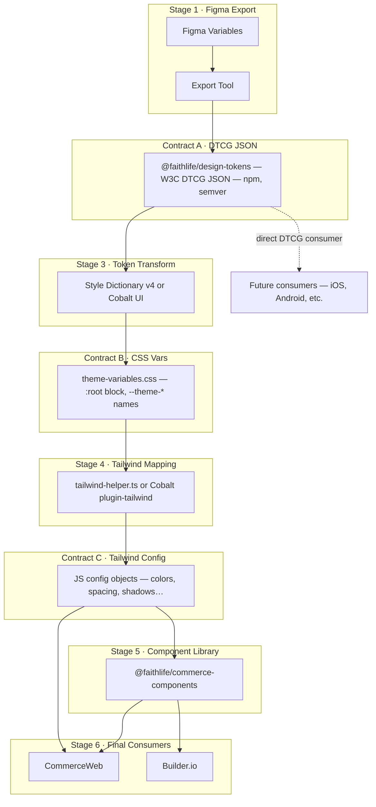
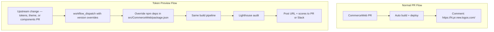

# 13 · Design Token Pipeline

> A specification for the full Figma-to-production token pipeline.
> Each stage is connected to the next by a well-defined **contract** — a versioned artifact with a stable format and location — so any stage's implementation can be swapped or fan out to multiple downstream consumers independently.

---

## Pipeline Overview



Dashed arrows represent optional fan-out paths that bypass one or more intermediate stages. Any stage reading only its declared contract input remains unaffected when the implementation behind an upstream stage changes.

---

## Architectural Principles

### 1. The DTCG format is the settled constant

The W3C Design Tokens Community Group (DTCG) JSON format is the one technology choice treated as fixed. All stages upstream produce it; all stages downstream consume it or a derivative. If the industry moves to a newer standard, only Contract A needs updating.

### 2. Contracts define the seams

Each inter-stage contract specifies:

| Property | What it means |
|----------|---------------|
| **Format** | The exact file format (JSON schema, CSS spec, JS module shape) |
| **Location** | Where the artifact lives (npm package, file path, GitHub release) |
| **Naming convention** | The key/property names consumers depend on |
| **Versioning** | How breaking changes are communicated (semver) |

A stage can be re-implemented in any tool or language as long as its output satisfies the downstream contract. The implementation is invisible to other stages.

### 3. 1-to-many fan-out is first-class

Contract A (DTCG JSON) is consumed by Stage 3 (CSS transform) today, and could simultaneously be consumed by a native mobile token pipeline, a documentation generator, or a third-party design tool — all without changes to Stage 1. The same principle applies at every contract boundary.

### 4. Breaking changes flow downstream explicitly

Each stage that can introduce breaking changes runs an automated diff against its last published contract artifact and blocks merge (or posts a warning) until a migration plan is attached. This surfaces impact as early as possible, at the stage that introduced the change, rather than letting it propagate silently to production.

---

## Contract Definitions

### Contract A — W3C DTCG JSON

| Property | Value |
|----------|-------|
| Format | W3C DTCG JSON (properties prefixed with `$`: `$value`, `$type`, `$description`) |
| Location | npm package `@faithlife/design-tokens` (or GitHub Packages) |
| Structure | One JSON file per Figma variable collection and mode; files nested under a `tokens/` directory in the package |
| Naming | Token paths mirror Figma collection/group hierarchy: `color.primary.subscription-blue.$value` |
| Versioning | semver — patch for value changes, minor for additions, major for removals or renames |
| Consumers | Stage 3 (CSS transform), any future native/platform consumer |

### Contract B — CSS Custom Properties

| Property | Value |
|----------|-------|
| Format | A CSS file with a single `:root {}` block containing CSS custom properties |
| Location | `theme-variables.css` shipped inside `@faithlife/commerce-theme` npm package |
| Naming | `--theme-{category}-{subcategory}-{property}`, e.g. `--theme-colors-primary-c300-hex`, `--theme-spacing-sp16`, `--theme-shadows-dp4` |
| Versioning | semver via `@faithlife/commerce-theme` — removing or renaming a property is a major bump |
| Consumers | Stage 4 (Tailwind mapping), any consumer that can load a CSS file (web, Electron, PWA) |

> **Stability guarantee**: The `--theme-*` naming scheme must remain stable across minor versions. Downstream code (component libraries, application CSS, Builder.io design tokens) depends on these names being predictable.

### Contract C — Tailwind Config Objects

| Property | Value |
|----------|-------|
| Format | JavaScript ES module exporting named config objects |
| Location | `@faithlife/commerce-theme/tailwind-helper` entry point |
| Shape | `tailwindColorConfig`, `tailwindSpacingConfig`, `tailwindFontSizeConfig`, `tailwindShadowConfig`, `tailwindTransitionDurationConfig`, `tailwindSafelistConfig`, `tailwindExtendedConfig` |
| Versioning | semver via `@faithlife/commerce-theme` — removing an export or changing a key is a major bump |
| Consumers | CommerceWeb `tailwind.config.js`, CommerceComponents `tailwind.config.js` |

---

## Stage 1 · Figma to DTCG JSON

**Responsibility**: Export Figma variables from the `Logos-Brand-Components` file into W3C DTCG JSON and open a pull request against the token repository.

**Contract output**: Contract A

### Recommended approach: Figma REST API + GitHub Actions

Figma Enterprise (already licensed) provides REST API access to variables. Figma's official reference implementation covers the full workflow:

- **Reference**: [figma/variables-github-action-example](https://github.com/figma/variables-github-action-example)
- The GitHub Action calls `GET /v1/files/:file_key/variables/local`
- Writes one DTCG JSON file per variable collection and mode into `tokens/`
- Opens a PR against the token repository for team review before merge
- Requires a Figma personal access token stored as a GitHub Actions secret

### Trigger options

| Option | Complexity | Latency | Best for |
|--------|-----------|---------|---------|
| Manual `workflow_dispatch` | Low | On demand | Getting started; controlled cadence |
| Figma webhook → relay → GitHub | Medium | ~seconds after Figma save | Fully automated sync |

**Webhook setup** (for the automated option):

1. Register a `FILE_VERSION_UPDATE` webhook on the Figma file via Figma's API (no UI — API call only)
2. Deploy a lightweight relay endpoint (Cloudflare Worker or AWS Lambda) that validates the webhook payload and calls the GitHub API to trigger `repository_dispatch`
3. The GitHub Actions workflow listens for `repository_dispatch` and runs the export

### In-Figma feedback

**GitFig** (free Figma plugin) provides bi-directional sync between Figma Variables and GitHub:

- Designers see whether their local variables match the committed token state
- Create branches, open PRs, and get conflict warnings without leaving Figma
- Monitors for changes every 3 seconds; alerts when GitHub has newer commits
- Satisfies the "in-Figma feedback for proposed changes" requirement

### Tool comparison

| Tool | Cost | DTCG | GitHub Sync | In-Figma Feedback | Breaking Change Detection |
|------|------|------|-------------|-------------------|--------------------------|
| Figma REST API + GH Action | Free (Enterprise included) | Native | GitHub Actions | None | Add downstream |
| GitFig | Free | Auto-detect (W3C, SD, TS) | Branches + PRs from Figma | Conflict warnings | None |
| TokensBrücke | Free (MIT) | Native | Push to GitHub/GitLab | None | None |
| Tokens Studio (free tier) | Free | Yes | GitHub sync | Basic | None |
| Tokens Studio Pro | EUR 39/user/mo | Yes | Multi-file sync | Token flow view | Token flow |

**Recommended combination**: Figma REST API + GH Action for the automated export pipeline, plus the GitFig plugin installed for any designer who wants in-Figma visibility into the current committed state.

### Swappability

Any tool or script that reads Figma variables (via REST API, plugin API, or MCP) and writes valid W3C DTCG JSON to the `tokens/` directory satisfies Contract A. The token repository and all downstream stages require no changes.

---

## Stage 2 · Token Repository (Versioning and Governance)

**Responsibility**: Store the canonical DTCG JSON, enforce versioning, detect breaking changes, and provide a stable, versioned artifact for downstream consumers.

**Contract input**: Contract A (DTCG JSON files)
**Contract output**: `@faithlife/design-tokens` npm package

### Repository structure options

| Option | Pros | Cons |
|--------|------|------|
| Dedicated `design-tokens` repo | Clean separation; independent release cycle; non-JS consumers can depend on it without pulling in JS tooling | Another repo to manage; Figma export PRs and theme transform PRs are decoupled |
| `tokens/` directory inside `CommerceComponents` | Co-located with Stage 3 transform code; single PR updates tokens and generated output together | Less separation; `@faithlife/commerce-theme` release cycle entangled with token changes |

**Recommendation**: Dedicated `design-tokens` repository. The token package is a dependency of multiple downstream consumers (`CommerceWeb`, `CommerceComponents`). Keeping it independent gives each consumer control over when to adopt a new token version, and makes the contract boundary explicit.

### Versioning

Uses `semantic-release` with conventional commits — the same pattern already in use for `@faithlife/commerce-theme`:

- **Patch** (`fix:`): token value changes (e.g. a color shifts from `#1e6afe` to `#1a60f0`)
- **Minor** (`feat:`): new tokens added
- **Major** (`feat!:` or `BREAKING CHANGE:`): tokens removed, renamed, or restructured

The PR that introduces breaking changes must also include a `migration.json` at the package root:

```json
{
  "removed": {
    "color.brand.subscription-blue": "color.primary.brand-blue"
  },
  "renamed": {
    "spacing.sm": "spacing.sp8"
  }
}
```

Downstream Stage 3 transforms can read this file to automatically apply renames before failing the build.

### Breaking-change detection: `@dtifx/diff`

`@dtifx/diff` (free, npm) compares DTCG token snapshots and enforces failure policies:

```yaml
# .github/workflows/token-diff.yml (runs on every PR)
- name: Diff tokens against last release
  run: npx @dtifx/diff --fail-on-breaking --output markdown >> $GITHUB_STEP_SUMMARY
```

- Loads the last published `@faithlife/design-tokens` version as the baseline
- Classifies every change: added / value-changed / removed / renamed
- `--fail-on-breaking` exits with code 1 if removals or renames are detected, blocking merge
- Outputs a human-readable markdown table as a PR comment and GitHub Step Summary

**Policy**: A PR with breaking changes can only merge after:
1. Adding `migration.json` with all rename/removal mappings
2. Bumping the commit type to `feat!:` to trigger a major version

### Swappability

Any package registry satisfies this stage's contract — npm, GitHub Packages, a private Verdaccio instance, or even a plain GitHub release asset containing the DTCG JSON. Downstream stages only need a way to resolve a specific version of the artifact.

---

## Stage 3 · DTCG to CSS Variables

**Responsibility**: Transform the versioned DTCG JSON into CSS custom properties that follow the established `--theme-*` naming convention.

**Contract input**: Contract A (`@faithlife/design-tokens` DTCG JSON)
**Contract output**: Contract B (`theme-variables.css`, `:root` block with `--theme-*` properties)

### Migration path from current hand-authored TypeScript

```
Current
  colors.ts + spacing.ts + fonts.ts + shadows.ts + transitions.ts
  → theme.ts (composes all)
  → generate-theme.ts (calls generateCSSVariables())
  → theme-variables.css (~565 CSS custom properties)

Future
  @faithlife/design-tokens (DTCG JSON)
  → Style Dictionary v4 or Cobalt UI (transform + format)
  → theme-variables.css (same --theme-* naming, same ~565 properties)
```

The critical constraint is **naming stability**: all downstream consumers (CommerceWeb, CommerceComponents, Builder.io design tokens registration) depend on `--theme-colors-primary-c300-hex`, `--theme-spacing-sp16`, etc. The transform configuration must map DTCG token paths to the existing `--theme-*` scheme rather than generating new names.

### Tool options

#### Style Dictionary v4 (recommended to evaluate first)

- **Cost**: Free, MIT license
- **Already a dependency** in `design_system_research/inventory/` (v4.3.3)
- Mature ecosystem with large community and extensive documentation
- Built-in DTCG support via `convertToDTCG()` and `typeDtcgDelegate()` utilities
- Custom transform can map DTCG paths to `--theme-*` names
- Plugin architecture allows generating CSS, JS, JSON, and platform-specific outputs from the same token source

Example transform config:

```js
// style-dictionary.config.js
export default {
  source: ['node_modules/@faithlife/design-tokens/tokens/**/*.json'],
  platforms: {
    css: {
      transformGroup: 'css',
      prefix: 'theme',
      buildPath: 'public/',
      files: [{ destination: 'theme-variables.css', format: 'css/variables' }],
    },
  },
};
```

#### Cobalt UI (`@cobalt-ui/cli`)

- **Cost**: Free, MIT license
- DTCG-native — reads DTCG JSON directly with no conversion step
- `co check` validates token schemas before build
- `@cobalt-ui/plugin-css` generates CSS variables with mode/theme support built in
- `@cobalt-ui/plugin-tailwind` can generate Tailwind presets directly, potentially replacing both Stage 3 and Stage 4 with a single tool
- Lighter and more focused than Style Dictionary

Example config:

```js
// tokens.config.js
export default {
  tokens: './node_modules/@faithlife/design-tokens/tokens/index.json',
  outDir: './public/',
  plugins: [
    pluginCSS({ prefix: 'theme', modeSelectors: [{ mode: 'light', selectors: [':root'] }] }),
  ],
};
```

### Breaking-change detection at this stage

A `compare-css-vars.ts` script runs in CI on every PR to `commerce-theme`:

1. Resolves and parses the current `theme-variables.css` (before the change)
2. Generates the new `theme-variables.css` from the updated token source
3. Diffs the two: reports added / removed / changed custom property names and values
4. Posts a markdown summary as a PR comment
5. Fails the build if any `--theme-*` property was removed (requires a major version bump)

### Swappability

Any tool that reads DTCG JSON and writes a CSS file containing a `:root {}` block with `--theme-*` property names satisfies Contract B. The Tailwind mapping in Stage 4 reads from the live CSS variables at runtime and requires no changes when the transform tool is swapped.

---

## Stage 4 · CSS Variables to Tailwind Config

**Responsibility**: Expose the `--theme-*` CSS custom properties as named Tailwind utility classes so components can use semantic class names (`bg-primary`, `p-sp16`, `shadow-dp4`) instead of raw CSS variable references.

**Contract input**: Contract B (`theme-variables.css`, loaded at build time via the `@faithlife/commerce-theme` JS theme object)
**Contract output**: Contract C (named JS config objects exported from `tailwind-helper.ts`)

### Current mechanism

`tailwind-helper.ts` in `@faithlife/commerce-theme` reads the TypeScript theme object (which mirrors the CSS variable values) and exports Tailwind-compatible config maps:

```ts
// tailwind.config.js in CommerceWeb and CommerceComponents
import { tailwindExtendedConfig, tailwindSafelistConfig } from '@faithlife/commerce-theme/tailwind-helper';

export default {
  theme: { extend: { ...tailwindExtendedConfig } },
  safelist: tailwindSafelistConfig,
};
```

Each consumer independently spreads these objects into its own Tailwind config. A change to `tailwind-helper.ts` propagates to all consumers on their next dependency update.

### Breaking-change detection at this stage

A CI step in `commerce-theme` uses Tailwind's `resolveConfig` API:

```ts
import resolveConfig from 'tailwindcss/resolveConfig';
const before = resolveConfig(loadConfig('tailwind.config.before.js'));
const after  = resolveConfig(loadConfig('tailwind.config.after.js'));
// diff before.theme vs after.theme — report removed/renamed keys
```

This surfaces which utility classes would be added, removed, or renamed as a result of a token change — before the package is published.

### Safelist

`tailwindSafelistConfig` ensures dynamically-constructed class names (e.g. classes built from user data or CMS content) are never purged by Tailwind's content scanning. Any new dynamic class pattern must be added to the safelist configuration in `tailwind-helper.ts`.

### Cobalt shortcut

If Stage 3 uses Cobalt UI, `@cobalt-ui/plugin-tailwind` can generate a Tailwind preset directly from DTCG JSON, bypassing the need for a separate `tailwind-helper.ts`. The Tailwind preset would still need to be versioned and exported with a stable shape (Contract C), but the implementation would be a Cobalt config rather than hand-authored TypeScript.

### Swappability

Any module that reads CSS custom property values and exports named Tailwind config objects with the established key names satisfies Contract C. Consumers import the named exports by key — removing or renaming a key is a breaking change requiring a major version of `@faithlife/commerce-theme`.

---

## Stage 5 · Component Library (CommerceComponents)

**Responsibility**: Provide tested, typed React components that consume Tailwind utilities backed by Contract C. Publish as `@faithlife/commerce-components` for use by CommerceWeb and Builder.io.

**Contract input**: Contract C (via `@faithlife/commerce-theme`)
**Contract output**: `@faithlife/commerce-components` npm package (consumed by CommerceWeb directly and by Builder.io for custom components)

### Current CI (already in place)

`.github/workflows/ci.yml` runs on every push to `master` and on PRs:

- `commitlint` — enforces conventional commit format
- `typecheck` — TypeScript compilation check
- `lint` — ESLint with `eslint-config-faithlife`
- `test:coverage` — Jest unit tests with coverage reporting
- `build` — tsup bundle
- `build-storybook` — Storybook static build
- `semantic-release` — publishes to npm on merge to `master`
- Storybook deployed to Vercel for visual review

### Proposed addition: automated token-bump workflow

When a new version of `@faithlife/commerce-theme` is published:

1. **Dependabot or Renovate** opens an automated PR bumping `@faithlife/commerce-theme` in `package.json`
2. Full CI runs automatically — typecheck, lint, tests, build, Storybook build
3. If Storybook builds successfully, **visual regression testing** compares the new Storybook against the baseline

Visual regression options:

| Tool | Cost | Integration | Self-hosted | Notes |
|------|------|-------------|-------------|-------|
| Playwright `toHaveScreenshot()` | Free | Storybook test runner | Yes | Fully self-contained; screenshots stored in repo |
| Lost Pixel OSS | Free (7k shots/mo) | Native Storybook support | Yes | Open-source engine; SaaS optional |
| Chromatic | $500+/mo | Richest Storybook support | No | Recurring cost; last resort |

**Recommendation**: Start with Playwright `toHaveScreenshot()`. It requires no external service, runs in GitHub Actions alongside existing tests, and stores baseline screenshots in the repository for Git-tracked history. Upgrade to Lost Pixel or Chromatic if the team needs richer diffing UI or parallel execution at scale.

---

## Stage 6 · Site Preview (CommerceWeb)

**Responsibility**: Deploy a full preview of the production site with an arbitrary combination of token/theme/component versions, allowing stakeholders to verify the visual impact of upstream changes before they reach production.

**Contract input**: `@faithlife/commerce-theme` and `@faithlife/commerce-components` npm packages (Contracts B and C)
**Deployment target**: CommerceWeb — ASP.NET MVC (.NET Framework 4.7.2) on Windows IIS/Azure, with webpack frontend build

### Existing PR preview infrastructure

Every CommerceWeb PR automatically builds and deploys to a preview server. Reviewers receive a comment on the PR:

```
PR deployed: https://98.pr.new.logos.com/
```

This infrastructure is already in place and requires no new tooling. The frontend build (`yarn --frozen-lockfile && yarn build` inside `src/CommerceWeb/`) picks up whatever npm dependency versions are pinned in `package.json`.

### Proposed extension: arbitrary-version token preview

A new `workflow_dispatch` workflow (or extension of the existing CI) accepts version overrides:

```yaml
# .github/workflows/token-preview.yml
on:
  workflow_dispatch:
    inputs:
      theme-version:
        description: '@faithlife/commerce-theme version (e.g. 3.0.0-beta.1)'
        required: false
      components-version:
        description: '@faithlife/commerce-components version'
        required: false
      tokens-version:
        description: '@faithlife/design-tokens version'
        required: false
```

Steps:

1. Check out the CommerceWeb repository at `HEAD` (or a specified ref)
2. Override dependencies: `yarn add @faithlife/commerce-theme@{input}` for each provided version
3. Run the standard frontend build: `yarn --frozen-lockfile && yarn build` inside `src/CommerceWeb/`
4. Deploy to the existing preview server infrastructure
5. Run Lighthouse against `lighthouse-budget.json` targets
6. Post the preview URL and Lighthouse scores to the originating issue, PR, or a Slack channel

This workflow can be triggered by anyone — a designer who wants to see their token changes live, a developer reviewing a theme PR, or an automated pipeline step. It does not require a CommerceWeb PR to exist.

### Normal vs. token-preview flows



### Swappability

The preview mechanism depends only on the ability to install a specific npm version of `@faithlife/commerce-theme` and `@faithlife/commerce-components`, then run the existing webpack build. If CommerceWeb migrates to containers or a different hosting platform (which the SitemapManager migration to .NET Aspire container apps suggests is a future direction), only the deploy step in this workflow changes. The version-override pattern and Lighthouse audit remain the same.

---

## Cost Summary

| Stage | Tool | Cost Category | Notes |
|-------|------|---------------|-------|
| 1 | Figma REST API + GitHub Actions | Free | Figma Enterprise already licensed |
| 1 | GitFig (in-Figma plugin) | Free | Companion designer tool |
| 1 | TokensBrücke | Free (MIT) | Alternative export plugin |
| 1 | Tokens Studio (free tier) | Free | Alternative with GitHub sync |
| 1 | Tokens Studio Pro | Recurring (EUR 39/user/mo) | Only if token flow features needed |
| 1 | Webhook relay (Cloudflare Worker) | Free (100k req/day free tier) | For automated trigger option |
| 2 | `@dtifx/diff` | Free (npm) | Breaking-change detection |
| 2 | `semantic-release` | Free (MIT) | Already used in CommerceComponents |
| 3 | Style Dictionary v4 | Free (MIT) | Already a dev dependency |
| 3 | Cobalt UI | Free (MIT) | Alternative DTCG-native transformer |
| 4 | `tailwind-helper.ts` | Free (in-house) | Already exists |
| 5 | Playwright visual regression | Free | Self-hosted in GitHub Actions |
| 5 | Lost Pixel OSS | Free (7k shots/mo) | Step up from Playwright if needed |
| 5 | Chromatic | Recurring ($500+/mo) | Last resort — richest Storybook UI |
| 6 | Existing preview infrastructure | Free (already paid) | No new infra needed |

**Summary**: The fully functional pipeline can be built at zero additional recurring cost. Tokens Studio Pro and Chromatic are the only recurring-cost items, and both are optional enhancements rather than required components.

---

## Implementation Phases

### Phase 1 — Token repository and breaking-change detection (foundation)

Everything downstream depends on Contract A being stable and versioned.

1. Create the `design-tokens` GitHub repository
2. Set up `semantic-release` with conventional commits
3. Run the Figma REST API export manually once to generate the initial `tokens/` structure
4. Add `@dtifx/diff` to the CI workflow
5. Publish the first `@faithlife/design-tokens@1.0.0` package
6. Update the `design_system_research` gap-analysis script to read from the package instead of MCP-extracted files

### Phase 2 — Automated export from Figma

1. Configure the GitHub Actions workflow to call the Figma REST API on `workflow_dispatch`
2. Have designers install the GitFig plugin for in-Figma visibility
3. Optionally wire up the Figma webhook + relay for fully automated triggering

### Phase 3 — DTCG to CSS transform (replace hand-authored TypeScript)

1. Add Style Dictionary v4 config to `commerce-theme` that reads from `@faithlife/design-tokens`
2. Run both the current `generate-theme.ts` and Style Dictionary in parallel; diff the output to verify naming parity
3. Once output matches, remove the hand-authored `colors.ts`, `spacing.ts`, etc.
4. Add the `compare-css-vars.ts` CI check
5. Publish `@faithlife/commerce-theme` patch release

### Phase 4 — Tailwind breaking-change detection

1. Add the `resolveConfig` diff step to the `commerce-theme` CI workflow
2. Update PR template to require a migration note when Tailwind config keys are removed

### Phase 5 — Component visual regression

1. Add Playwright `toHaveScreenshot()` tests for all Storybook stories
2. Configure Dependabot or Renovate to open automated PRs for `@faithlife/commerce-theme` updates
3. Verify the visual diff catches token-driven style changes

### Phase 6 — Arbitrary-version site preview

1. Add the `token-preview.yml` workflow to CommerceWeb
2. Test with a pre-release version of `@faithlife/commerce-theme`
3. Wire up Lighthouse budget reporting to the workflow output

---

## Appendix: Migration from Current Architecture

The current architecture has hand-authored TypeScript as the source of truth for tokens. The pipeline migration shifts source of truth to Figma without disrupting any downstream consumer.

### Step 1: Establish the token package alongside the existing theme

- Publish `@faithlife/design-tokens@1.0.0` from the current Figma export (no changes to `commerce-theme` yet)
- This is purely additive — nothing breaks

### Step 2: Generate CSS from DTCG in parallel

- Add Style Dictionary config to `commerce-theme` that reads from `@faithlife/design-tokens`
- Run Style Dictionary output alongside the existing `generate-theme.ts` output
- Diff the two CSS files to find any naming mismatches
- Fix the Style Dictionary transform config until output matches

### Step 3: Switch the source of truth

- Once Style Dictionary output matches the hand-authored output exactly:
  - Remove `colors.ts`, `spacing.ts`, `fonts.ts`, `shadows.ts`, `transitions.ts` from `commerce-theme/src/`
  - Remove `generate-theme.ts`
  - Add `@faithlife/design-tokens` as a dependency of `commerce-theme`
  - Style Dictionary becomes the single source of `theme-variables.css`
- Publish `@faithlife/commerce-theme` minor release (no CSS variable names changed)

### Step 4: Connect Figma

- Set up the GitHub Actions workflow for Figma REST API export
- Any Figma variable change now flows through the full pipeline on the next export run

### Step 5: Enable breaking-change guardrails

- Add `@dtifx/diff` to the token repository CI
- Add `compare-css-vars.ts` to `commerce-theme` CI
- Add Tailwind `resolveConfig` diff to `commerce-theme` CI
- Add Playwright visual regression to `commerce-components` CI

### Step 6: Enable site preview

- Add `token-preview.yml` to CommerceWeb
- The full pipeline is now operational end-to-end

---

*This document is hand-authored and not generated by `generate-docs.ts`. It is strategic guidance, not derived from Figma data. Update it when pipeline decisions change.*
