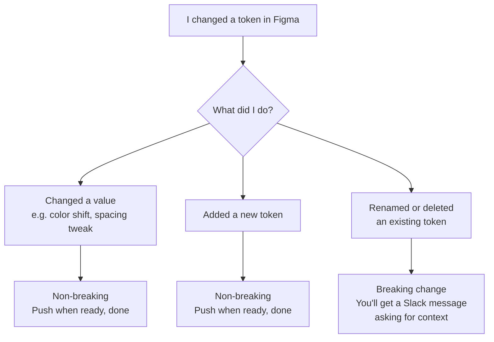
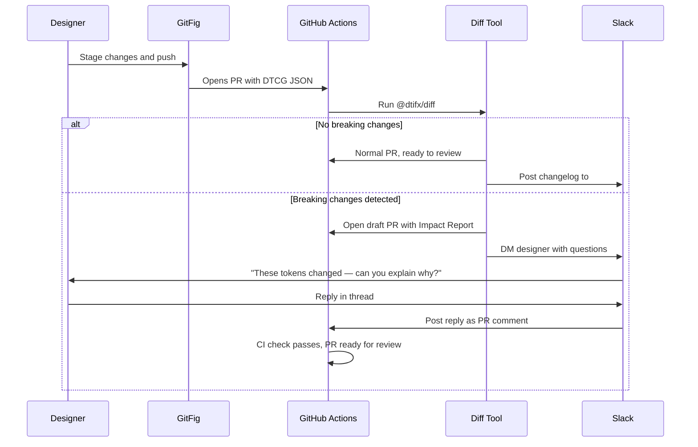

# 14 · Designer-Developer Handoff

> This document is written for **designers and design system leads**.
> It describes how token changes flow from Figma into the codebase, what feedback you'll receive, and what (rarely) you'll be asked to do when a change needs extra care.
>
> The goal is simple: **you should feel free to create**. The system handles the hard parts and only asks for your input when a human judgment call is genuinely needed.

---

## What kind of change am I making?

Most token changes require nothing from you after you push them. Only **breaking changes** — removing or renaming an existing token — require a brief follow-up.



If you're unsure whether a change is breaking, the in-Figma tools below will tell you.

---

## Step 1 · Preview your changes inside Figma

Before pushing anything, two free Figma plugins let you understand the impact of your changes without leaving Figma.

### Variable Mode Injector

[Variable Mode Injector](https://www.figma.com/community/plugin/1581328658919282285) lets you preview token changes side-by-side on real designs before committing.

- Drop your updated `tokens.json` onto the plugin
- It injects the new values as a test mode inside your existing variable collection
- Toggle between the current mode and the test mode to see the visual diff instantly
- Zero broken links -- variable IDs stay the same
- Delete the test mode when you're done; no changes are committed to Figma

**When to use it**: Anytime you're changing token values and want to see how they affect real screens before pushing.

### TokenOps

[TokenOps](https://www.figma.com/community/plugin/1588136910586914696) audits which components and frames reference a given variable.

- Search for a token by name to see every place it's used
- Use this before deleting or renaming a token to understand the blast radius
- Helps you decide: "Is this safe to remove, or should I deprecate it first?"

**When to use it**: Before deleting or renaming any existing token.

---

## Step 2 · Push your changes with GitFig

[GitFig](https://gitfig.com/) is the bridge between Figma and the codebase. It gives you full control over when changes are sent.

### How to push

1. Open the GitFig plugin in Figma
2. You'll see a list of all variables that have changed since the last push
3. Stage the changes you want to include (individually or "Stage All")
4. Write a short description of what changed (one or two sentences is fine)
5. Push to GitHub
6. Optionally open a pull request -- or push multiple batches to the same branch before opening one

You control the batch. There is no automatic push on every save. Push when you feel your set of changes is complete and cohesive.

### The backup option

If GitFig isn't available, a developer or design system lead can trigger a manual export from GitHub Actions at any time. This pulls the current state of all Figma variables and opens a PR with whatever has changed since the last run.

---

## Step 3 · What happens after you push

The system automatically analyzes your changes and routes them:



---

## Layer 2 · Non-breaking changes (most changes)

If your push contains only value changes and new additions, you don't need to do anything else.

The system opens a normal pull request with an auto-generated changelog:

```
Token update: 3 color values updated, 1 spacing token added
- color.primary.brand-blue: #1e6afe → #1a60f0
- spacing.sp20 added (20px)
```

A developer reviews and merges it. You'll get a Slack notification when it's merged.

---

## Layer 3 · Breaking changes — the Slack brief

If you removed or renamed a token, the system opens a **draft pull request** (not ready to merge) and sends you a Slack message.

### What the Slack message looks like

> **Design System Bot**
>
> Hey Alex — your token push included some changes that will need migration work from developers.
>
> **What changed:**
> - Removed: `color.brand.subscription-blue`
> - Renamed: `spacing.sm` (new name unknown)
>
> To help the team plan the migration, could you answer these three questions? Just reply in this thread — no coding required.
>
> 1. **Why did these change?** (e.g. "subscription-blue was consolidated into the primary blue family")
> 2. **What should developers use instead?** (e.g. "use `color.primary.brand-blue`" or "there is no direct replacement, use the semantic token for your context")
> 3. **Is this urgent or can it wait?** (e.g. "needs to ship with the rebrand in Q2" or "not urgent, clean-up only")

### What to write

There's no format to follow. A few sentences in plain language is all that's needed. The developers who handle the migration will read your reply and use it to plan their work.

### Example reply

> "subscription-blue was the old name before we simplified the color system. Anything using it should switch to `color.primary.brand-blue` — it's the same visual color. spacing.sm was never used in production, it was a leftover from an old scale. Safe to remove with no replacement."

Once you reply, the bot posts your answer to the pull request and the migration is unblocked. You won't need to look at any code or GitHub links.

---

## Layer 4 · Team notifications

Every push sends a summary to the `#design-system` Slack channel so the whole team stays informed.

| Change type | Slack message |
|-------------|---------------|
| Non-breaking | "Token update merged: 3 colors updated, 1 spacing token added. No migration needed." |
| Breaking (awaiting notes) | "Token update needs migration context: 2 tokens removed. Alex, check your DMs." |
| Breaking (notes received, PR open) | "Token migration PR ready for review: [link]. Migration notes provided." |

---

## Alternative approaches

If the Slack bot isn't available or isn't the right fit, these approaches can serve the same purpose:

- **GitHub Issue Form**: a structured web form (like a survey) linked to the PR. The designer fills it out in the browser; no PR editing required. CI check verifies it's complete before merge.
- **PR description template**: the draft PR body is pre-filled with a simple section to complete. Designer edits the PR description directly on GitHub. A GitHub Action validates the placeholder text has been replaced. Requires the designer to interact with GitHub directly.
- **Combined Slack + PR**: Slack notification links directly to the PR with instructions. Designer fills in the PR template. Middle ground between the two above.

---

## Tool summary

| Tool | What it does | Cost |
|------|-------------|------|
| [Variable Mode Injector](https://www.figma.com/community/plugin/1581328658919282285) | Preview token changes side-by-side in Figma | Free |
| [TokenOps](https://www.figma.com/community/plugin/1588136910586914696) | Audit which components use a variable before removing it | Free |
| [GitFig](https://gitfig.com/) | Push Figma variable changes to GitHub, open PRs | Free |
| [@dtifx/diff](https://dtifx.lapidist.net/diff/) | Detect breaking changes automatically | Free |
| Slack bot | Deliver impact reports and collect migration notes | Free (self-hosted) |

---

*This document is hand-authored and not generated by the inventory build pipeline. For the technical pipeline specification see [doc 13 — Design Token Pipeline](./13-token-pipeline.md).*
