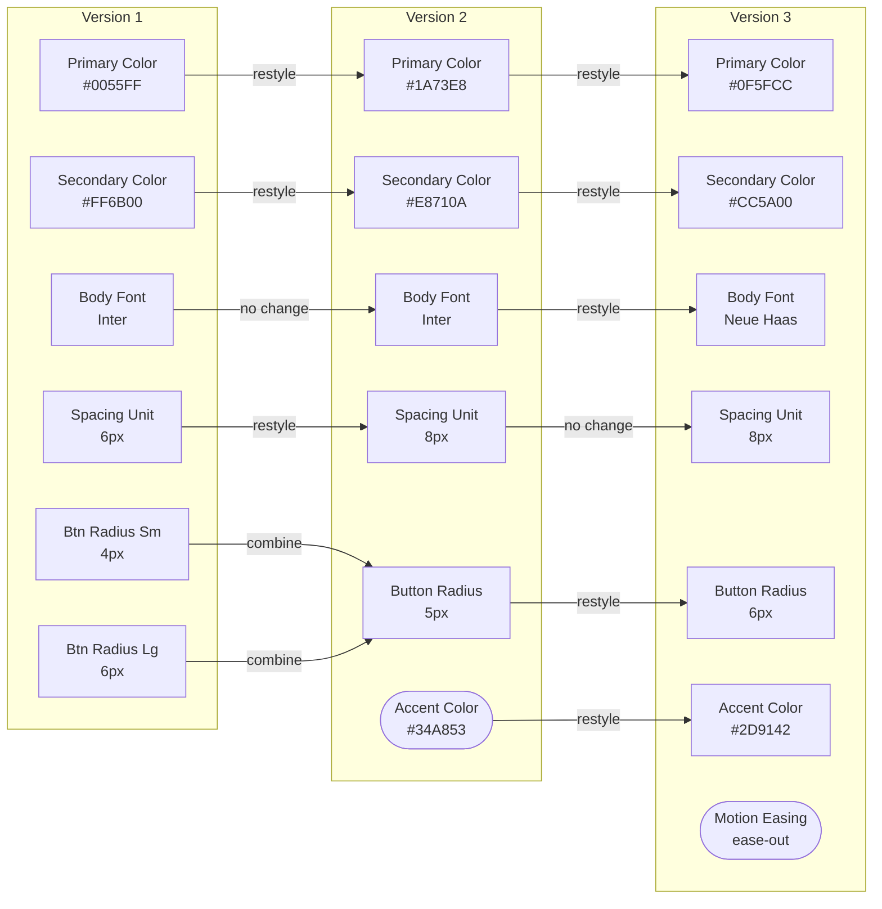
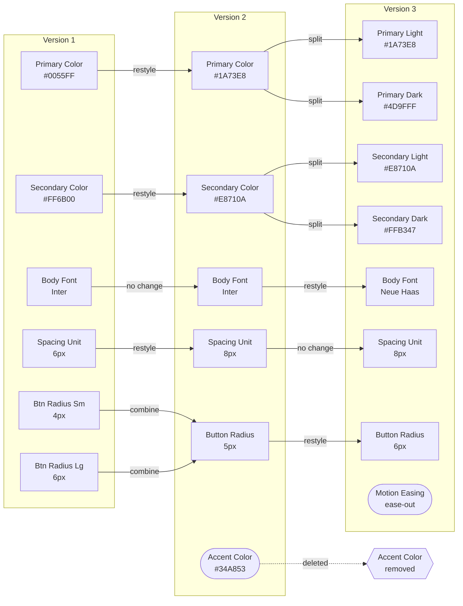
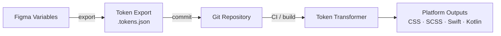

# Design System Theme Evolution

Two diagrams showing how a design system's theme elements can evolve across versions. Both use three version columns (V1 → V2 → V3) with the same starting elements, but the set of permitted operations differs between them.

**Reading the diagrams:**

- Rectangular nodes `[ ]` — a carried-forward element
- Pill nodes `([ ])` — a newly introduced element
- Hexagon nodes `{{ }}` — a removed element *(Diagram 2 only)*
- Arrow labels — the operation applied between versions (`no change` = same name, same value, passes through untouched)

---

## Context

Design tokens — the named values that define a visual language (colors, spacing, typography, etc.) — start out as a convenience. They become infrastructure the moment multiple teams depend on them: when changing a single value requires coordination, when breaking one means breaking something in production, when the design team's decisions are someone else's deployment.

At that threshold, the *rules governing how tokens can change* matter as much as the tokens themselves. The two diagrams below describe two different rule sets, and the downstream effects of each.

**The semantic versioning parallel** is useful here. In software, a patch version bump (`1.0.0 → 1.0.1`) fixes a value without changing behavior; a minor bump (`1.0.0 → 1.1.0`) adds something new without removing anything; a major bump (`1.0.0 → 2.0.0`) introduces breaking changes that consumers must actively migrate to. Mapped to token operations:

- Restyle = patch (value changes, reference holds)
- New element = minor (additive, nothing breaks)
- Combine = minor (simplifying, references consolidate)
- Split = major (reference must be updated to a new name)
- Delete = major (reference is broken until migrated)

Diagram 1 describes a system that never ships a major version. Diagram 2 does not have that constraint.

**The entropy pattern** is the common failure mode of an unconstrained system without governance. Without a rule against it, a team under pressure adds `color.blue-new` rather than updating `color.blue`. Later someone adds `color.blue-final`. Then `color.blue-actually-final`. Each of those is an uncoordinated split or addition — individually reasonable, collectively a system that has become impossible to reason about or maintain.

These diagrams encode the governance as constraints, rather than describing it in a separate policy document. The rule set is the system.

---

## Diagram 1: A Persistent Design System

*Permitted operations: restyle, combine, create new. Splitting and deletion are not allowed.*

### What this shows

**Restyle** keeps the token name constant while its value changes. When `Primary Color` updates from `#0055FF` to `#1A73E8`, every component referencing that token picks up the new value automatically. The reference never breaks; the token's identity is preserved.

**Combine** reconciles two inconsistent values for the same concept into one. `Btn Radius Sm` and `Btn Radius Lg` — two named variants that accumulated from independent design decisions — are consolidated into a single `Button Radius (5px)` token. Every component now references one source of truth, and future updates only need to happen in one place.

**No change** means the token passes through a version update untouched — same name, same value. Not every token needs to change in every release. `Body Font` carries forward from V1 to V2 unchanged, then restyles in V3. `Spacing Unit` restyles in V2 and then holds steady into V3. This is the normal steady state for most tokens in most releases.

**New elements** are purely additive. `Accent Color` and `Motion Easing` each begin in the version they're introduced, with no effect on anything that came before.

**Effects across versions:**

- Consumer code (component libraries, stylesheets, application logic) requires no changes between versions — all references remain valid.
- Version-to-version diffs are small and predictable: updated values, a reduced set of tokens after combines, or new additions.
- Every element can be traced back to its origin. The history is linear and unambiguous.
- The total token count tends to hold steady or decrease as combines take effect.
- The constraint: once two tokens are combined they cannot be separated without restructuring; elements that no longer serve a purpose cannot be removed.

---

## Diagram 2: An Open Design System

*All operations from Diagram 1, plus: split and delete.*

### What this shows

The V1 → V2 step is identical to Diagram 1: restyles, a combine, and one new element, with no breaking changes. The V2 → V3 step introduces two additional operations.

**Split** forks a single token into multiple variants. `Primary Color` becomes `Primary Light` and `Primary Dark` — a natural outcome when adding dark mode support to the product. Each fork is now an independent element with its own future maintenance path: its own restyles, combines, or further splits.

**Delete** removes a token from the system entirely. `Accent Color`, introduced in V2, is removed in V3. Any consumer that referenced it must be located and updated; the reference no longer resolves.

**Effects across versions:**

- V1 → V2 behaves identically to Diagram 1: no breaking changes, all references held intact.
- V2 → V3 introduces breaking changes. Consumers using `Primary Color` or `Secondary Color` by their original names must migrate to a Light or Dark variant. Consumers using `Accent Color` must remove or replace the reference.
- Splits increase the total number of tokens, growing the surface area that every future version must account for.
- Deletions require active coordination: deprecation notices, a versioned changelog, and migration documentation help prevent silent failures in downstream consumers.
- The system can stay more precisely aligned with evolving product needs. The overhead of tracking and communicating changes grows in proportion to the number of splits and deletions introduced over time.

---

## Figma to Code: A Concrete Interface

The operations in both diagrams map directly onto a real, production-ready toolchain. The pipeline has four generic stages:

**Stage 1 — Figma Variables** are the design-side source of truth. Designers define and update token values here.

**Stage 2 — Token export** produces a `.tokens.json` file in the W3C Design Tokens Community Group (DTCG) format — a stable, tool-neutral exchange format now adopted by Figma and most major design and development tools.

**Stage 3 — Git repository** stores the token file under version control. Every change is a commit; every proposed change is a pull request. This is the handoff point between design and code: the PR is where both teams review what changed and whether it follows the agreed-upon rules.

**Stage 4 — Token transformer** converts the token file into platform-specific outputs automatically. No hand-editing of generated files. One source, many targets.

### How each operation flows through the pipeline

**Restyle** — Update a value in Figma, export, commit. The `.tokens.json` file changes one value. The transformer regenerates the output. All consumers receive the new value with no code changes required. The PR diff is a single line.

**Combine** — Merge two Figma Variables into one, update any references within the Figma file, export. The `.tokens.json` file loses one entry. Downstream output loses one variable. The PR diff shows a deletion and updated references — reviewable, predictable.

**New element** — Add a Figma Variable, export, commit. The `.tokens.json` gains one entry. A new variable appears in the output. Nothing existing is affected.

**Split** — Add a Figma Variable Mode (Figma's built-in mechanism for light/dark/brand variants). The export produces multiple values where there was one. The output gains new variable names. Any consumer using the original name must update to reference a specific mode — a migration, not an automatic update.

**Delete** — Remove a Figma Variable, export, commit. The `.tokens.json` loses an entry. The corresponding output variable disappears. Any code referencing it breaks at build time until migrated.

### What this means for the two diagrams

The Diagram 1 constraint set (restyle, combine, new only) means every PR to the token repository is non-breaking. A simple CI check can enforce it: if any token name present in the previous version is absent in the new version, reject the change. Reviewers only need to verify intent, not audit for downstream breakage.

Diagram 2's constraint set requires more infrastructure around the pipeline: deprecation notices communicated before removal, a versioned changelog so consumers know what changed between releases, and migration guides for any split or delete. The pipeline itself is the same — the governance layer around it is heavier.
