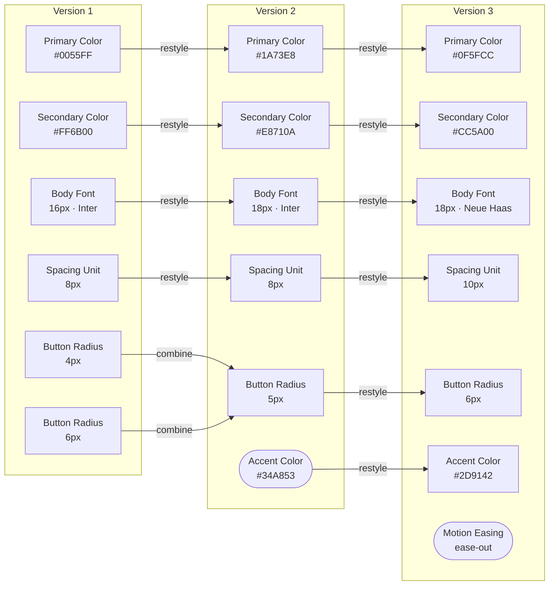
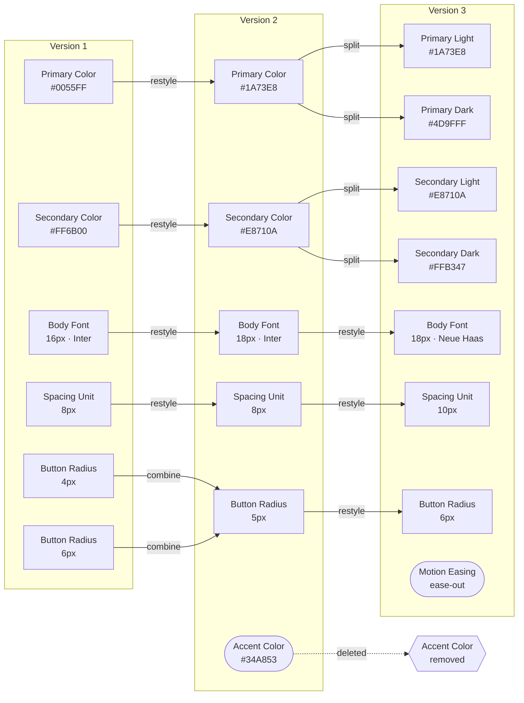

# Design System Theme Evolution

Two diagrams showing how a design system's theme elements can evolve across versions. Both use three version columns (V1 → V2 → V3) with the same starting elements, but the set of permitted operations differs between them.

**Reading the diagrams:**

- Rectangular nodes `[ ]` — a carried-forward element
- Pill nodes `([ ])` — a newly introduced element
- Hexagon nodes `{{ }}` — a removed element *(Diagram 2 only)*
- Arrow labels — the operation applied between versions

---

## Diagram 1: A Persistent Design System

*Permitted operations: restyle, combine, create new. Splitting and deletion are not allowed.*

### What this shows

**Restyle** keeps the token name constant while its value changes. When `Primary Color` updates from `#0055FF` to `#1A73E8`, every component referencing that token picks up the new value automatically. The reference never breaks; the token's identity is preserved.

**Combine** reconciles two inconsistent values for the same concept into one. `Button Radius` existed as both `4px` and `6px` in different parts of the system — a common result of independent design decisions over time. Combining them into a single `5px` token means every component now references one source of truth, and future updates only need to happen in one place.

**New elements** are purely additive. `Accent Color` and `Motion Easing` each begin in the version they're introduced, with no effect on anything that came before.

**Effects across versions:**

- Consumer code (component libraries, stylesheets, application logic) requires no changes between versions — all references remain valid.
- Version-to-version diffs are small and predictable: updated values, a reduced set of tokens after combines, or new additions.
- Every element can be traced back to its origin. The history is linear and unambiguous.
- The total token count tends to hold steady or decrease as combines take effect.
- The constraint: once two tokens are combined they cannot be separated without restructuring; elements that no longer serve a purpose cannot be removed.

---

## Diagram 2: An Open Design System

*All operations from Diagram 1, plus: split and delete.*

### What this shows

The V1 → V2 step is identical to Diagram 1: restyles, a combine, and one new element, with no breaking changes. The V2 → V3 step introduces two additional operations.

**Split** forks a single token into multiple variants. `Primary Color` becomes `Primary Light` and `Primary Dark` — a natural outcome when adding dark mode support to the product. Each fork is now an independent element with its own future maintenance path: its own restyles, combines, or further splits.

**Delete** removes a token from the system entirely. `Accent Color`, introduced in V2, is removed in V3. Any consumer that referenced it must be located and updated; the reference no longer resolves.

**Effects across versions:**

- V1 → V2 behaves identically to Diagram 1: no breaking changes, all references held intact.
- V2 → V3 introduces breaking changes. Consumers using `Primary Color` or `Secondary Color` by their original names must migrate to a Light or Dark variant. Consumers using `Accent Color` must remove or replace the reference.
- Splits increase the total number of tokens, growing the surface area that every future version must account for.
- Deletions require active coordination: deprecation notices, a versioned changelog, and migration documentation help prevent silent failures in downstream consumers.
- The system can stay more precisely aligned with evolving product needs. The overhead of tracking and communicating changes grows in proportion to the number of splits and deletions introduced over time.
